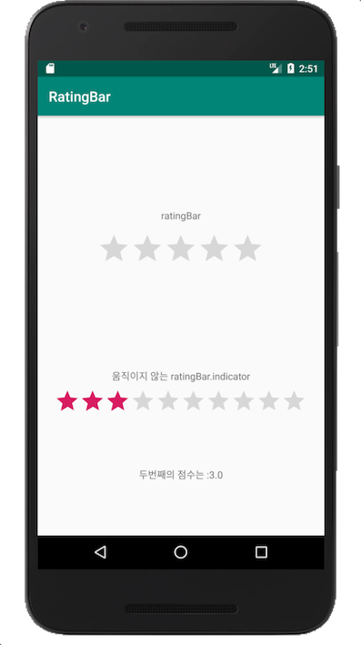
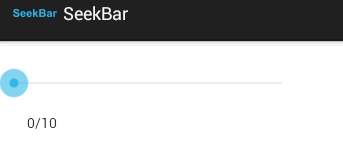
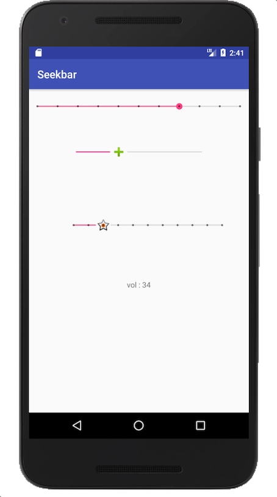
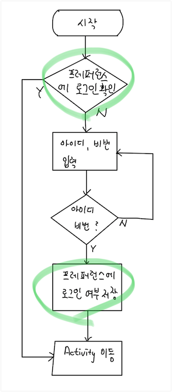
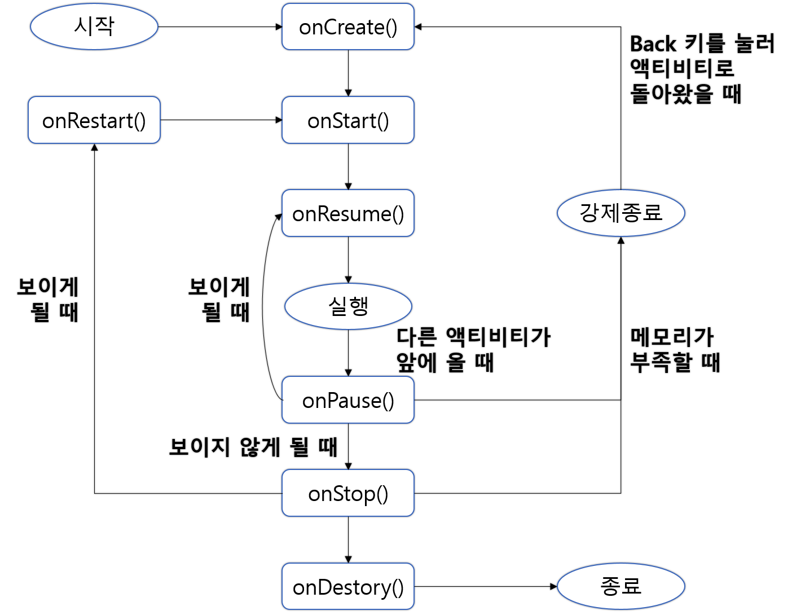

# 03. 애플리케이션 구성하기

## 03-3 인텐트 살펴보기

- **명시적 인텐트** : 호출할 대상을 지정하여 대상을 읽어 오는 인텐트 사용

  ```java
  Intent intent = new Intent(MainActivity.this, SubActivity.class);
  ```

  위와 코드에서 'SubActivity'라는 대상을 지정하고 있다.


- **명시적 인텐트의 사용예**

  p.260)  03-2 화면 구성과 화면 간 전환


- **암시적 인텐트** : 액션과 데이터를 지정하였지만 호출하는 대상이 변경되는 인텐트 사용

- ```java
  Intent intent = new Intent(Intent.ACTION_VIEW,
                              Uri.parse("http://www.naver.com"));
  ```

  인텐트로 인터넷 주소를 전달하는 경우, 아래 이미지처럼 어느 앱으로 웹페이지를 열지 선택해야 웹페이지를 볼 수 있다. 이처럼 호출 되는 대상이 경우에 따라 변경되는 인텐트 사요영태가 암시적 인텐트라 할 수 있다.

  

   

  P. 270의 엑티비티 간의 인텐트 전달 다이어그램 참조


- **암시적 인텐트 사용예**

```java
Intent intent = new Intent(액션, 데이터);
```


| 액션               | 데이터                                  | 용도          |
| ------------------ | --------------------------------------- | ------------- |
| Intent.ACTION_VIEW | Uri.parse("http://www.naver.com")       | 웹페이지 접속 |
| Intent.ACTION_VIEW | Uri.parse("tel:010-1234-5678")          | 전화걸기      |
| Intent.ACTION_VIEW | Uri.parse("geo:36.6349120,127.4869820") | 지도보기      |
| Intent.ACTION_VIEW | Uri.parse("content://contacts/people/") | 주소록 보기   |


- **예제** 

  - (MainActivity.java)

    ```java
    ...
    
    public class MainActivity extends AppCompatActivity {
    
    
        Button btn_web, btn_phone, btn_map, btn_contacts;
    
        @Override
        protected void onCreate(Bundle savedInstanceState) {
            super.onCreate(savedInstanceState);
            setContentView(R.layout.activity_main);
    
            btn_web = (Button)findViewById(R.id.btn_web);
            btn_phone = (Button)findViewById(R.id.btn_phone);
            btn_map = (Button)findViewById(R.id.btn_map);
            btn_contacts = (Button)findViewById(R.id.btn_contacts);
    
            IntentBtnListener intentBtnListener = new IntentBtnListener();
    
            btn_web.setOnClickListener(intentBtnListener);
            btn_phone.setOnClickListener(intentBtnListener);
            btn_map.setOnClickListener(intentBtnListener);
            btn_contacts.setOnClickListener(intentBtnListener);
        }
    
        class IntentBtnListener implements View.OnClickListener {
            Intent intent = null;
    
            @Override
            public void onClick(View view) {
                switch(view.getId()) {
                    case R.id.btn_web:
                        intent = new Intent(Intent.ACTION_VIEW,
                                Uri.parse("http://www.naver.com"));
                        break;
                    case R.id.btn_phone:
                        intent = new Intent(Intent.ACTION_VIEW,
                                Uri.parse("tel:01012345678"));
                        break;
                    case R.id.btn_map:
                        intent = new Intent(Intent.ACTION_VIEW,
                                Uri.parse("geo:36.6349120,127.4869820"));
                        break;
                    case R.id.btn_contacts:
                        intent = new Intent(Intent.ACTION_VIEW,
                                Uri.parse("content://contacts/people/"));
                        break;
                }
                if(intent != null) {
                    startActivity(intent);
                }
    
            }
        }
    }
    
    ```

  - activity_main.xml

    

    ```xml
    <?xml version="1.0" encoding="utf-8"?>
    <android.support.constraint.ConstraintLayout xmlns:android="http://schemas.android.com/apk/res/android"
        xmlns:app="http://schemas.android.com/apk/res-auto"
        xmlns:tools="http://schemas.android.com/tools"
        android:layout_width="match_parent"
        android:layout_height="match_parent"
        tools:context=".MainActivity">
    
        <Button
            android:id="@+id/btn_web"
            android:layout_width="wrap_content"
            android:layout_height="wrap_content"
            android:layout_marginBottom="8dp"
            android:layout_marginEnd="8dp"
            android:layout_marginStart="8dp"
            android:layout_marginTop="8dp"
            android:text="web"
            app:layout_constraintBottom_toBottomOf="parent"
            app:layout_constraintEnd_toEndOf="parent"
            app:layout_constraintStart_toStartOf="parent"
            app:layout_constraintTop_toTopOf="parent"
            app:layout_constraintVertical_bias="0.091" />
    
        <Button
            android:id="@+id/btn_phone"
            android:layout_width="wrap_content"
            android:layout_height="wrap_content"
            android:layout_marginBottom="8dp"
            android:layout_marginEnd="8dp"
            android:layout_marginStart="8dp"
            android:layout_marginTop="8dp"
            android:text="phone"
            app:layout_constraintBottom_toBottomOf="parent"
            app:layout_constraintEnd_toEndOf="parent"
            app:layout_constraintStart_toStartOf="parent"
            app:layout_constraintTop_toTopOf="parent"
            app:layout_constraintVertical_bias="0.302" />
    
        <Button
            android:id="@+id/btn_map"
            android:layout_width="wrap_content"
            android:layout_height="wrap_content"
            android:layout_marginBottom="8dp"
            android:layout_marginEnd="8dp"
            android:layout_marginStart="8dp"
            android:layout_marginTop="8dp"
            android:text="map"
            app:layout_constraintBottom_toBottomOf="parent"
            app:layout_constraintEnd_toEndOf="parent"
            app:layout_constraintStart_toStartOf="parent"
            app:layout_constraintTop_toTopOf="parent" />
    
        <Button
            android:id="@+id/btn_contacts"
            android:layout_width="wrap_content"
            android:layout_height="wrap_content"
            android:layout_marginBottom="8dp"
            android:layout_marginEnd="8dp"
            android:layout_marginStart="8dp"
            android:layout_marginTop="8dp"
            android:text="contacts"
            app:layout_constraintBottom_toBottomOf="parent"
            app:layout_constraintEnd_toEndOf="parent"
            app:layout_constraintStart_toStartOf="parent"
            app:layout_constraintTop_toTopOf="parent"
            app:layout_constraintVertical_bias="0.682" />
    
    </android.support.constraint.ConstraintLayout>
    ```

- ### ,,### Quiz) EditText를 활용하여 전화번호를 입력받고 버튼을 선택하면, 스마트폰에 전화 어플이 나타나 전화를 할 수 있는 앱을 작성하시오.,,

- **인텐트 안에 데이터 저장하기**

  인텐트 안에는 데이터를 저장할 수 이는 번들(Bundle) 객체가 있으며, 번들 안에 데이터를 넣을 때는 데이터의 이름(name, 교제에서는 Key)와 값(value)를 쌍으로 만들어 데이터를 읽고 쓴다.


- **데이터 저장 예시**

  ```java
  // MainActivity 에서
  
  Intent intent = new Intent(MainActivity.this, SubActivity.class);
  intent.putExtra(이름, 값);
  ```


| 데이터             | 함수 표현                            |
| ------------------ | ------------------------------------ |
| String             | putExtra(String name, String value)  |
| int                | putExtra(String name, int value)     |
| boolean            | putExtra(String name, boolean value) |
| double             | putExtra(String name, double value)  |
| float              | putExtra(String name, float value)   |
| int[] (배열형)     | putExtra(String name, int value)     |
| boolean[] (배열형) | putExtra(String name, boolean value) |
| double[] (배열형)  | putExtra(String name, double value)  |
| float[] (배열형)   | putExtra(String name, float value)   |


- **데이터 읽기 예시**

  ```java
  // SubActivity 에서
  String val_str; int val_int; boolean val_bool;
  double val_double; float val_float;
  int[] arr_int; boolean[] arr_bool;
  double[] arr_double; float[] arr_float;
  
  Intent intent = getIntent();
  if(intent != null) {
      val_str 	= intent.getStringExtra(String name);
   	val_int 	= intent.getIntExtra(String name, int defaultValue);
      val_bool 	= intent.getBooleanExtra(String name, boolean defaultValue);
      val_double 	= intent.getDoubleExtra(String name, double defaultValue);
      val_float 	= intent.getFloatExtra(String name, float defaultValue);   
      arr_int 	= intent.getIntArrayExtra(String name);
      arr_bool 	= intent.getBooleanArrayExtra(String name);
      arr_double 	= intent.getDoubleArrayExtra(String name);
      arr_float 	= intent.getFloatArrayExtra(String name);
  }
  ```

  배열형의 자료도 저장할 수 있고, 기본 자료형의 경우는 name에 매칭되는 데이터 값이 없으면 디폴드(defaultValue)값이 리턴된다.


- **예제**

  - MainActivity

  ```java
  public class MainActivity extends AppCompatActivity {
  
      Button btn_send;
      Intent intent;
  
      @Override
      protected void onCreate(Bundle savedInstanceState) {
          super.onCreate(savedInstanceState);
          setContentView(R.layout.activity_main);
          btn_send = (Button)findViewById(R.id.btn_send);
  
          intent = new Intent(MainActivity.this, SubActivity.class);
          intent.putExtra("int_value", 1234);
          intent.putExtra("str_value", "my intent");
          intent.putExtra("bool_value", true);
          intent.putExtra("double_value", 3.14d);
          intent.putExtra("float_value", 42.195f);
  
          int[] int_arr = {1,2,3};
          boolean[] bool_arr = {true, false, true};
          double[] double_arr = {4.4d, 5.5d, 6.6d};
          float[] float_arr = {1.1f, 2.2f, 3.3f};
  
          intent.putExtra("int_arr", int_arr);
          intent.putExtra("bool_arr", bool_arr);
          intent.putExtra("double_arr", double_arr);
          intent.putExtra("float_arr", float_arr);
  
          btn_send.setOnClickListener(new View.OnClickListener() {
              @Override
              public void onClick(View view) {
                  startActivity(intent);
              }
          });
      }
  }
  ```

  - SubActivity

  ```java
  public class SubActivity extends AppCompatActivity {
      String val_str; int val_int; boolean val_bool;
      double val_double; float val_float;
      int[] arr_int; boolean[] arr_bool;
      double[] arr_double; float[] arr_float;
  
      TextView tv_show;
  
      @Override
      protected void onCreate(Bundle savedInstanceState) {
          super.onCreate(savedInstanceState);
          setContentView(R.layout.activity_sub);
  
          tv_show = (TextView)findViewById(R.id.tv_show);
  
          Intent intent = getIntent();
          if(intent != null) {
              val_str 	= intent.getStringExtra("str_value");
              val_int 	= intent.getIntExtra("int_value", -1);
              val_bool 	= intent.getBooleanExtra("bool_value", false);
              val_double 	= intent.getDoubleExtra("double_value", -1);
              val_float 	= intent.getFloatExtra("float_value", -1);
              arr_int 	= intent.getIntArrayExtra("int_arr");
              arr_bool 	= intent.getBooleanArrayExtra("bool_arr");
              arr_double 	= intent.getDoubleArrayExtra("double_arr");
              arr_float 	= intent.getFloatArrayExtra("float_arr");
  
              tv_show.setText(
                      "전달된 String 값 : " + val_str + "\n" +
                      "전달된 int 값 : " + val_int + "\n" +
                      "전달된 boolean 값 : " + val_bool + "\n" +
                      "전달된 double 값 : " + val_double + "\n" +
                      "전달된 float 값 : " + val_float + "\n" +
                      "전달된 int 배열 값 : " + arr_int + "\n" +
                      "전달된 boolean 배열 값 : " + arr_bool[0] + "\t" + arr_bool[1] + "\t" + arr_bool[2] + "\n" +
                      "전달된 double 배열 값 : " + arr_double[0] + "\t" + arr_double[1] + "\t" + arr_double[2] + "\n" +
                      "전달된 float 배열 값 : " + arr_float[0] + "\t" + arr_float[1] + "\t" + arr_float[2] + "\n" );
          }
      }
  }
  
  ```

  - activity_main

  ```xml
  <?xml version="1.0" encoding="utf-8"?>
  <android.support.constraint.ConstraintLayout xmlns:android="http://schemas.android.com/apk/res/android"
      xmlns:app="http://schemas.android.com/apk/res-auto"
      xmlns:tools="http://schemas.android.com/tools"
      android:layout_width="match_parent"
      android:layout_height="match_parent"
      tools:context=".MainActivity">
  
      <Button
          android:id="@+id/btn_send"
          android:layout_width="wrap_content"
          android:layout_height="wrap_content"
          android:text="send"
          app:layout_constraintBottom_toBottomOf="parent"
          app:layout_constraintEnd_toEndOf="parent"
          app:layout_constraintHorizontal_bias="0.5"
          app:layout_constraintStart_toStartOf="parent"
          app:layout_constraintTop_toTopOf="parent" />
  </android.support.constraint.ConstraintLayout>
  ```

  - activity_sub

  ```xml
  <?xml version="1.0" encoding="utf-8"?>
  <android.support.constraint.ConstraintLayout xmlns:android="http://schemas.android.com/apk/res/android"
      xmlns:app="http://schemas.android.com/apk/res-auto"
      xmlns:tools="http://schemas.android.com/tools"
      android:layout_width="match_parent"
      android:layout_height="match_parent"
      tools:context=".SubActivity">
  
      <TextView
          android:id="@+id/tv_show"
          android:layout_width="0dp"
          android:layout_height="0dp"
          android:textSize="18sp"
          app:layout_constraintBottom_toBottomOf="parent"
          app:layout_constraintEnd_toEndOf="parent"
          app:layout_constraintHorizontal_bias="0.0"
          app:layout_constraintStart_toStartOf="parent"
          app:layout_constraintTop_toTopOf="parent" />
  </android.support.constraint.ConstraintLayout>
  ```


- **레이팅바 (Rating bar)**

앱스토어나, 쇼핑몰 같이 사용자의 평가를 받을 수 있는 레이팅 바를 제공한다. 레이팅 바를 활용하여 사용자로 부터 직접 평점을 받을 수 있거나 조작없이 단순히 점수를 표시할 수도 있다.

 


- 예제

  - MainActivity.java

  ```java
  public class MainActivity extends AppCompatActivity {
  
      RatingBar ratingBar1, ratingBar2;
      TextView tv_result;
  
      @Override
      protected void onCreate(Bundle savedInstanceState) {
          super.onCreate(savedInstanceState);
          setContentView(R.layout.activity_main);
  
          ratingBar1 = (RatingBar)findViewById(R.id.ratingBar1);
          ratingBar2 = (RatingBar)findViewById(R.id.ratingBar2);
          tv_result = (TextView)findViewById(R.id.tv_result);
  
          ratingBar1.setOnRatingBarChangeListener(new RatingBar.OnRatingBarChangeListener() {
              @Override
              public void onRatingChanged(RatingBar ratingBar, float v, boolean b) {
                  switch(ratingBar.getId()) {
                      case R.id.ratingBar1:
                          Toast.makeText(MainActivity.this, "첫번째 점수는 : " + v,
                                  Toast.LENGTH_SHORT).show();
                          break;
                  }
              }
          });
  
          tv_result.setText("두번째의 점수는 :" + ratingBar2.getRating());
      }
  
  }
  ```


  - 주요 속성

| 속성        | 설명                                               |
| ----------- | -------------------------------------------------- |
| number      | 별의 최대 개수                                     |
| rating      | 선택한 점수                                        |
| stepSize    | 별점의 단위                                        |
| isIndicator | true 이면 수정 불가능, false 이면 사용자 선택 가능 |


  - activity_main.xml

  

  ```
  <?xml version="1.0" encoding="utf-8"?>
  <android.support.constraint.ConstraintLayout xmlns:android="http://schemas.android.com/apk/res/android"
      xmlns:app="http://schemas.android.com/apk/res-auto"
      xmlns:tools="http://schemas.android.com/tools"
      android:layout_width="match_parent"
      android:layout_height="match_parent"
      tools:context=".MainActivity"
      tools:layout_editor_absoluteY="81dp">
  
      <RatingBar
          android:id="@+id/ratingBar1"
          android:layout_width="wrap_content"
          android:layout_height="wrap_content"
          android:numStars="5"
          android:stepSize="0.5"
          app:layout_constraintBottom_toTopOf="@+id/ratingBar2"
          app:layout_constraintEnd_toEndOf="parent"
          app:layout_constraintHorizontal_bias="0.5"
          app:layout_constraintStart_toStartOf="parent"
          app:layout_constraintTop_toTopOf="parent" />
  
      <RatingBar
          android:id="@+id/ratingBar2"
          style="@style/Widget.AppCompat.RatingBar.Indicator"
          android:layout_width="wrap_content"
          android:layout_height="wrap_content"
          android:layout_marginBottom="8dp"
          android:numStars="10"
          android:rating="3"
          app:layout_constraintBottom_toBottomOf="parent"
          app:layout_constraintEnd_toEndOf="parent"
          app:layout_constraintHorizontal_bias="0.5"
          app:layout_constraintStart_toStartOf="parent"
          app:layout_constraintTop_toBottomOf="@+id/ratingBar1" />
  
      <TextView
          android:id="@+id/textView"
          android:layout_width="wrap_content"
          android:layout_height="wrap_content"
          android:layout_marginStart="8dp"
          android:layout_marginTop="8dp"
          android:layout_marginEnd="8dp"
          android:text="ratingBar"
          app:layout_constraintBottom_toTopOf="@+id/ratingBar1"
          app:layout_constraintEnd_toEndOf="parent"
          app:layout_constraintHorizontal_bias="0.501"
          app:layout_constraintStart_toStartOf="parent"
          app:layout_constraintTop_toTopOf="parent"
          app:layout_constraintVertical_bias="0.9" />
  
      <TextView
          android:id="@+id/textView2"
          android:layout_width="wrap_content"
          android:layout_height="wrap_content"
          android:layout_marginStart="8dp"
          android:layout_marginTop="236dp"
          android:layout_marginEnd="8dp"
          android:layout_marginBottom="8dp"
          android:text="움직이지 않는 ratingBar.indicator"
          app:layout_constraintBottom_toTopOf="@+id/ratingBar2"
          app:layout_constraintEnd_toEndOf="parent"
          app:layout_constraintHorizontal_bias="0.502"
          app:layout_constraintStart_toStartOf="parent"
          app:layout_constraintTop_toTopOf="parent"
          app:layout_constraintVertical_bias="1.0" />
  
      <TextView
          android:id="@+id/tv_result"
          android:layout_width="wrap_content"
          android:layout_height="wrap_content"
          android:layout_marginStart="8dp"
          android:layout_marginTop="8dp"
          android:layout_marginEnd="8dp"
          android:layout_marginBottom="8dp"
          android:text="TextView"
          app:layout_constraintBottom_toBottomOf="parent"
          app:layout_constraintEnd_toEndOf="parent"
          app:layout_constraintStart_toStartOf="parent"
          app:layout_constraintTop_toBottomOf="@+id/ratingBar2" />
  
  </android.support.constraint.ConstraintLayout>
  ```


- SeekBar

특정 값을 입력받기 위해 EditText를 활용하여 값을 입력 받을 수 있다. 경우에 따라 일정 범위의 숫자(예 : RGB값(0~ 255), 소리 볼룸 크기 등)를 입력받는다면 시크바를 활용하여 간단한 슬라이드 동작으로 값을 입력 받을 수 있다.




- 예제

  - MainActivity.java

  ```java
  public class MainActivity extends AppCompatActivity {
  
      SeekBar seekbar_red, seekbar_green;
      TextView mVol;
      @Override
      protected void onCreate(Bundle savedInstanceState) {
          super.onCreate(savedInstanceState);
          setContentView(R.layout.activity_main);
  
          seekbar_green = (SeekBar)findViewById(R.id.seekbar_green);
          seekbar_red = (SeekBar)findViewById(R.id.seekbar_red);
          mVol = (TextView)findViewById(R.id.textview_vol);
  
          seekbar_red.setOnSeekBarChangeListener(new SeekBar.OnSeekBarChangeListener() {
              @Override
              public void onProgressChanged(SeekBar seekBar, int i, boolean b) {
                  mVol.setText("vol : " + i);
              }
  
              @Override
              public void onStartTrackingTouch(SeekBar seekBar) {
  
              }
  
              @Override
              public void onStopTrackingTouch(SeekBar seekBar) {
  
              }
          });
      }
  }
  
  ```

  - 주요 속성

    | 속성     | 설명                                    |
    | -------- | --------------------------------------- |
    | max      | 슬라이스 하여 입력할 수 있는 최대 값    |
    | progress | 입력값                                  |
    | thumb    | 슬라이스하는 아이콘 이미지              |
    | style    | Discrete 속성을 선택하면 눈금이 생긴다. |


  - activity_main.xml

  
  ```xml
  <?xml version="1.0" encoding="utf-8"?>
  <android.support.constraint.ConstraintLayout xmlns:android="http://schemas.android.com/apk/res/android"
      xmlns:app="http://schemas.android.com/apk/res-auto"
      xmlns:tools="http://schemas.android.com/tools"
      android:layout_width="match_parent"
      android:layout_height="match_parent"
      tools:context="com.example.raejin.seekbar.MainActivity">
  
      <SeekBar
          android:id="@+id/seekbar_red"
          android:layout_width="268dp"
          android:layout_height="68dp"
          android:layout_marginBottom="431dp"
          android:layout_marginEnd="170dp"
          android:layout_marginStart="170dp"
          android:layout_marginTop="62dp"
          android:max="100"
          android:thumb="@android:drawable/ic_input_add"
          app:layout_constraintBottom_toBottomOf="parent"
          app:layout_constraintEnd_toEndOf="parent"
          app:layout_constraintStart_toStartOf="parent"
          app:layout_constraintTop_toTopOf="parent" />
  
      <SeekBar
          android:id="@+id/seekbar_green"
          style="@style/Widget.AppCompat.SeekBar.Discrete"
          android:layout_width="310dp"
          android:layout_height="28dp"
          android:layout_marginBottom="329dp"
          android:layout_marginEnd="170dp"
          android:layout_marginStart="170dp"
          android:layout_marginTop="84dp"
          android:max="10"
          android:progress="3"
          android:thumb="@android:drawable/star_on"
          app:layout_constraintBottom_toBottomOf="parent"
          app:layout_constraintEnd_toEndOf="parent"
          app:layout_constraintHorizontal_bias="0.429"
          app:layout_constraintStart_toStartOf="parent"
          app:layout_constraintTop_toBottomOf="@+id/seekbar_red"
          app:layout_constraintVertical_bias="0.363" />
  
      <SeekBar
          android:id="@+id/seekBar"
          style="@style/Widget.AppCompat.SeekBar.Discrete"
          android:layout_width="match_parent"
          android:layout_height="wrap_content"
          android:layout_marginBottom="19dp"
          android:max="10"
          android:progress="3"
          app:layout_constraintBottom_toTopOf="@+id/seekbar_red"
          app:layout_constraintEnd_toEndOf="parent"
          app:layout_constraintStart_toStartOf="parent"
          app:layout_constraintTop_toTopOf="parent" />
  
  
      <TextView
          android:id="@+id/textview_vol"
          android:layout_width="wrap_content"
          android:layout_height="wrap_content"
          android:layout_marginBottom="226dp"
          android:layout_marginEnd="163dp"
          android:layout_marginStart="163dp"
          android:layout_marginTop="84dp"
          android:text="TextView"
          app:layout_constraintBottom_toBottomOf="parent"
          app:layout_constraintEnd_toEndOf="parent"
          app:layout_constraintStart_toStartOf="parent"
          app:layout_constraintTop_toBottomOf="@+id/seekbar_green" />
  
  </android.support.constraint.ConstraintLayout>
  
  ```


- Time Picker & Date Picker

안드로이드는 시간과 날짜를 간편하게 입력받을 수 있는 Time Picker와 Date Picker를 제공한다. 입력된 시간과 날짜는 

OnTimeSetListener와 OnDateListener를 통해 처리할 수 있다. 단 OnDateListener에서 얻어지는 월 값이 0부터 시작(1월 : 0, 12월 :11 값을 가진다)하여 표현됨에 주의하자


- 예제

  - MainActivity.java

    ```java
    public class MainActivity extends AppCompatActivity {
    
        Button btn_date_picker, btn_time_picker;
        int year, month, day, hour, min;
    
        @Override
        protected void onCreate(Bundle savedInstanceState) {
            super.onCreate(savedInstanceState);
            setContentView(R.layout.activity_main);
    
            btn_date_picker = (Button)findViewById(R.id.btn_date_picker);
            btn_time_picker = (Button)findViewById(R.id.btn_time_picker);
    
            GregorianCalendar calendar = new GregorianCalendar();
            year = calendar.get(Calendar.YEAR);
            month = calendar.get(Calendar.MONTH);
            day = calendar.get(Calendar.DAY_OF_MONTH);
            hour = calendar.get(Calendar.HOUR_OF_DAY);
            min = calendar.get(Calendar.MINUTE);
    
            btn_date_picker.setOnClickListener(new View.OnClickListener() {
                @Override
                public void onClick(View view) {
                    new DatePickerDialog(MainActivity.this,
                            dateSetListener, year, month, day).show();
                }
            });
    
            btn_time_picker.setOnClickListener(new View.OnClickListener() {
                @Override
                public void onClick(View view) {
                    new TimePickerDialog(MainActivity.this, timeSetListener, hour, min, false).show();
                }
            });
        }
    
        private DatePickerDialog.OnDateSetListener dateSetListener = new DatePickerDialog.OnDateSetListener() {
            @Override
            public void onDateSet(DatePicker datePicker, int i, int i1, int i2) {
            	// 월은 0부터 시작된다
                Toast.makeText(MainActivity.this, i + "/" + (i1+1) + "/"+ i2,
                        Toast.LENGTH_LONG).show();
            }
        };
    
        private TimePickerDialog.OnTimeSetListener timeSetListener = new TimePickerDialog.OnTimeSetListener() {
            @Override
            public void onTimeSet(TimePicker timePicker, int i, int i1) {
                Toast.makeText(MainActivity.this, i + ":" + i1,
                        Toast.LENGTH_LONG).show();
            }
        };
    }
    
    
    ```

  - activity_main.java

  

  ```xml
  <?xml version="1.0" encoding="utf-8"?>
  <android.support.constraint.ConstraintLayout xmlns:android="http://schemas.android.com/apk/res/android"
      xmlns:app="http://schemas.android.com/apk/res-auto"
      xmlns:tools="http://schemas.android.com/tools"
      android:layout_width="match_parent"
      android:layout_height="match_parent"
      tools:context="com.example.raejin.datetimepicker.MainActivity"
      tools:layout_editor_absoluteY="81dp">
  
      <Button
          android:id="@+id/btn_date_picker"
          android:layout_width="wrap_content"
          android:layout_height="wrap_content"
          android:layout_marginBottom="8dp"
          android:layout_marginEnd="8dp"
          android:layout_marginStart="8dp"
          android:layout_marginTop="8dp"
          android:text="Date Picker"
          app:layout_constraintBottom_toTopOf="@+id/guideline2"
          app:layout_constraintEnd_toEndOf="parent"
          app:layout_constraintHorizontal_bias="0.031"
          app:layout_constraintStart_toStartOf="parent"
          app:layout_constraintTop_toTopOf="parent"
          app:layout_constraintVertical_bias="1.0" />
  
      <Button
          android:id="@+id/btn_time_picker"
          android:layout_width="wrap_content"
          android:layout_height="wrap_content"
          android:layout_marginBottom="8dp"
          android:layout_marginEnd="8dp"
          android:layout_marginStart="8dp"
          android:layout_marginTop="8dp"
          android:text="Time Picker"
          app:layout_constraintBottom_toTopOf="@+id/guideline2"
          app:layout_constraintEnd_toEndOf="parent"
          app:layout_constraintStart_toStartOf="parent"
          app:layout_constraintTop_toTopOf="parent" />
  
      <android.support.constraint.Guideline
          android:id="@+id/guideline2"
          android:layout_width="wrap_content"
          android:layout_height="wrap_content"
          android:orientation="horizontal"
          app:layout_constraintGuide_begin="64dp" />
  
  </android.support.constraint.ConstraintLayout>
  
  ```


## 추가 내용) SharedPreferences

SharedPreferences는 앱의 데이터를 영속적으로 저장하기 위한 클래스이다. sqlite와 같은 DBMS 방식의 데이터 저장 방식은 테이블의 형태로 데이터를 저장하지만 SharedPreferences는 간단한 키-값(key-value)형태로 데이터를 저장한다. SharedPreferences로 저장하는 데이터는 내부에서 xml 파일로 저장되지만 개발자가 직접 파일을 읽고 쓰는 코드를 작성하지 않고, SharedPreferences 객체를 이용하여 간단하게 데이터를 읽고 쓸 수 있다.


- 주요 함수

  ```java
  SharedPreferences sharedPref = getSharedPreferences("filename", Context.MODE_PRIVATE);
  ```

  getSharedPreferences() 함수는 첫 매개변수인 파일이름으로 정보를 저장한다. 이 파일 이름으로 다른 액티비티에서 데이터를 공유하여 이용할 수 있다. 또한 파일이름으로 데이터를 구분하여 저장하기도 한다.


  - getSharedPreferences() 함수의 모드 값

    | 모드                 | 설명                                              |
    | -------------------- | ------------------------------------------------- |
    | MODE_PREVATE         | 자기 앱 내에서 사용, 외부 앱에서 접근 불가 (추천) |
    | MODE_WORLD_REDABLE   | 외부 앱에서 읽기 가능                             |
    | MODE_WORLD_WRITEABLE | 외부 앱에서 쓰기 가능                             |


  ```java
  SharedPreferences.Editor editor = sharedPref.edit();
  editor.putString("key1", "this is string data");
  editor.putInt("key2", 1234);
  editor.putBoolean("key3", true);
  editor.putLong("key4", 1234);
  editor.putFloat("key5", 3.14f);
  Set<String> arr = new HashSet<String>();
  arr.add("hi");
  arr.add("android");
  editor.putStringSet("key6", arr);
  
  editor.commit();
  ```

  프레퍼런스에 데이터를 저장하기 위해서는 SharedPreferences.Editor 클래스를 활용해야 한다. 이후에는 put 시리즈 함수들을 활용하여 데이터를 설정한다. 이후에는 commit() 함수로 저장한 내용을 파일에 기록하게 된다.


  - put 함수들

    | 함수                                       | 설명                                 |
    | ------------------------------------------ | ------------------------------------ |
    | putString(String key, String data)         | String형 데이터를 저장한다.          |
    | putInt(String key, int data)               | int형 데이터를 저장한다.             |
    | putBoolean(String key, boolean data)       | boolean형 데이터를 저장한다.         |
    | putLong(String key, long data)             | long형 데이터를 저장한다.            |
    | putFloat(String key, float data)           | float형 데이터를 저장한다.           |
    | putStringSet(String key, Set<String> data) | Set<String>형태의 데이터를 저장한다. |


  ```java
  SharedPreferences sharedPref = getSharedPreferences("filename", Context.MODE_PRIVATE);
  
  String data_str     = sharedPref.getString("key1", "no data");
  int data_int        = sharedPref.getInt("key2", -1);
  boolean data_bool   = sharedPref.getBoolean("key3", false);
  long data_long       = sharedPref.getLong("key4", -1);
  float data_float    = sharedPref.getFloat("key5", -1);
  Set<String> data_set = sharedPref.getStringSet("key6", new HashSet<String>());
  ```

  저장된 데이터를 읽어올 때는 SharedPreference 클래스의 get 함수들을 활용한다.


  - get 함수들

    | 함수                                               | 설명                              |
    | -------------------------------------------------- | --------------------------------- |
    | getString(String key, String default_data)         | String형 데이터를 읽어 온다.      |
    | getInt(String key, Int default_data)               | Int형 데이터를 읽어 온다.         |
    | getBoolean(String key, Boolean default_data)       | Boolean형 데이터를 읽어 온다.     |
    | getLong(String key, Long default_data)             | Long형 데이터를 읽어 온다.        |
    | getFloat(String key, Float default_data)           | Float형 데이터를 읽어 온다.       |
    | getStringSet(String key, Set<String> default_data) | Set<String>형 데이터를 읽어 온다. |


- 예제 코드

  - MainActivity.java

  ```java
  public class MainActivity extends AppCompatActivity {
      Button btn_move;
  
      @Override
      protected void onCreate(Bundle savedInstanceState) {
          super.onCreate(savedInstanceState);
          setContentView(R.layout.activity_main);
          btn_move = (Button)findViewById(R.id.btn_move);
          btn_move.setOnClickListener(new View.OnClickListener() {
              @Override
              public void onClick(View view) {
                  Intent intent = new Intent(MainActivity.this, MoveActivity.class);
                  startActivity(intent);
              }
          });
  
          SharedPreferences sharedPref = getSharedPreferences("filename", Context.MODE_PRIVATE);
  
          SharedPreferences.Editor editor = sharedPref.edit();
          editor.putString("key1", "this is string data");
          editor.putInt("key2", 1234);
          editor.putBoolean("key3", true);
          editor.putLong("key4", 1234);
          editor.putFloat("key5", 3.14f);
  
          Set<String> arr = new HashSet<String>();
          arr.add("hi");
          arr.add("android");
          editor.putStringSet("key6", arr);
          editor.commit();
      }
  }
  ```

  - activity_main.xml

  ```xml
  <?xml version="1.0" encoding="utf-8"?>
  <android.support.constraint.ConstraintLayout xmlns:android="http://schemas.android.com/apk/res/android"
      xmlns:app="http://schemas.android.com/apk/res-auto"
      xmlns:tools="http://schemas.android.com/tools"
      android:layout_width="match_parent"
      android:layout_height="match_parent"
      tools:context=".MainActivity">
  
      <Button
          android:id="@+id/btn_move"
          android:layout_width="wrap_content"
          android:layout_height="wrap_content"
          android:text="SEND"
          app:layout_constraintBottom_toBottomOf="parent"
          app:layout_constraintEnd_toEndOf="parent"
          app:layout_constraintHorizontal_bias="0.5"
          app:layout_constraintStart_toStartOf="parent"
          app:layout_constraintTop_toTopOf="parent" />
  </android.support.constraint.ConstraintLayout>
  ```

  - MoveActivity.java

  ```java
  public class MoveActivity extends AppCompatActivity {
  
      TextView tv_show;
  
      @Override
      protected void onCreate(Bundle savedInstanceState) {
          super.onCreate(savedInstanceState);
          setContentView(R.layout.activity_move);
          tv_show = (TextView)findViewById(R.id.tv_show);
  
          SharedPreferences sharedPref = getSharedPreferences("filename", Context.MODE_PRIVATE);
  
          String data_str     = sharedPref.getString("key1", "no data");
          int data_int        = sharedPref.getInt("key2", -1);
          boolean data_bool   = sharedPref.getBoolean("key3", false);
          long data_long       = sharedPref.getLong("key4", -1);
          float data_float    = sharedPref.getFloat("key5", -1);
          Set<String> data_set = sharedPref.getStringSet("key6", new HashSet<String>());
  
          String text = "data_str : " + data_str + "\n" +
                  "data_int : " + data_int + "\n" +
                  "data_bool : " + data_bool + "\n" +
                  "data_long : " + data_long + "\n" +
                  "data_float : " + data_float + "\n" +
                  "data_set : " + data_set + "\n";
  
          tv_show.setText(text);
      }
  }
  ```

  - activity_move.xml

  ```xml
  <?xml version="1.0" encoding="utf-8"?>
  <android.support.constraint.ConstraintLayout xmlns:android="http://schemas.android.com/apk/res/android"
      xmlns:app="http://schemas.android.com/apk/res-auto"
      xmlns:tools="http://schemas.android.com/tools"
      android:layout_width="match_parent"
      android:layout_height="match_parent"
      tools:context=".MoveActivity">
  
      <TextView
          android:id="@+id/tv_show"
          android:layout_width="0dp"
          android:layout_height="0dp"
          android:text="TextView"
          android:textSize="24sp"
          app:layout_constraintBottom_toBottomOf="parent"
          app:layout_constraintEnd_toEndOf="parent"
          app:layout_constraintHorizontal_bias="0.5"
          app:layout_constraintStart_toStartOf="parent"
          app:layout_constraintTop_toTopOf="parent" />
  </android.support.constraint.ConstraintLayout>
  ```

  ​                                              


### Quiz) MyMovieApp 프로젝트에서 앱의 로그인 화면에서 로그인하였을때, 로그인 여부를 저장하여, 이후에는 자동 로그인 되도록 코드를 작성하자.




## 03-5 액티비티 수명주기

액티비티는 실행부터 종료까지 여러 상태를 거치며 상태가 변할때마다 생명 주기 함수가 자동으로 호출된다. 액티비티의 상태는 활성, 일시정지, 비활성이 있다.

| 상태                        | 설명                                                         |
| --------------------------- | ------------------------------------------------------------ |
| 활성상태 (activity running) | 현재 액티비티가 화면을 점유하고 있으며, 사용자 이벤트 처리가 정상으로 치리되는 상태 |
| 일시정지 (pause)            | 현재 액티비티가 일시적으로 사용이 불가능한 상태              |
| 비활성 상태 (stop)          | 현재 액티비티가 다른 액티비티로 인해 가려진 상태             |




- 예제

  - MainActivity.java

  ```java
  public class MainActivity extends AppCompatActivity {
  
      Button button_main;
      @Override
      protected void onCreate(Bundle savedInstanceState) {
          super.onCreate(savedInstanceState);
          setContentView(R.layout.activity_main);
  
          button_main = (Button)findViewById(R.id.button_main);
          button_main.setOnClickListener(new View.OnClickListener() {
              @Override
              public void onClick(View view) {
                  Intent intent = new Intent(
                          MainActivity.this, SubActivity.class);
                  startActivity(intent);
              }
          });
          Log.d("activity_cycle", "MainActivity에서 onCreate() 호출");
      }
  
      protected void onStart() {
          super.onStart();
          Log.d("activity_cycle", "MainActivity에서 onStart() 호출");
      }
  
      protected void onResume() {
          super.onResume();
          Log.d("activity_cycle", "MainActivity에서 onResume() 호출");
      }
  
      protected void onPause() {
          super.onPause();
          Log.d("activity_cycle", "MainActivity에서 onPause() 호출");
      }
  
      protected void onStop() {
          super.onStop();
          Log.d("activity_cycle", "MainActivity에서 onStop() 호출");
      }
  
      protected void onDestroy() {
          super.onDestroy();
          Log.d("activity_cycle", "MainActivity에서 onDestroy() 호출");
      }
  
      protected void onRestart() {
          super.onRestart();
          Log.d("activity_cycle", "MainActivity에서 onRestart() 호출");
      }
  }
  ```

  - SubActivity.java

  ```java
  public class SubActivity extends AppCompatActivity {
      @Override
      protected void onCreate(@Nullable Bundle savedInstanceState) {
          super.onCreate(savedInstanceState);
          setContentView(R.layout.activity_sub);
      }
  
      protected void onStart() {
          super.onStart();
          Log.d("activity_cycle", "SubActivity에서 onStart() 호출");
      }
  
      protected void onResume() {
          super.onResume();
          Log.d("activity_cycle", "SubActivity에서 onResume() 호출");
      }
  
      protected void onPause() {
          super.onPause();
          Log.d("activity_cycle", "SubActivity에서 onPause() 호출");
      }
  
      protected void onStop() {
          super.onStop();
          Log.d("activity_cycle", "SubActivity에서 onStop() 호출");
      }
  
      protected void onDestroy() {
          super.onDestroy();
          Log.d("activity_cycle", "SubActivity에서 onDestroy() 호출");
      }
  
      protected void onRestart() {
          super.onRestart();
          Log.d("activity_cycle", "SubActivity에서 onRestart() 호출");
      }
  }
  ```

  - activity_main.xml

  ```xml
  <?xml version="1.0" encoding="utf-8"?>
  <android.support.constraint.ConstraintLayout xmlns:android="http://schemas.android.com/apk/res/android"
      xmlns:app="http://schemas.android.com/apk/res-auto"
      xmlns:tools="http://schemas.android.com/tools"
      android:layout_width="match_parent"
      android:layout_height="match_parent"
      tools:context="com.example.a501_00.activitylifecycle.MainActivity">
  
      <Button
          android:id="@+id/button_main"
          android:layout_width="wrap_content"
          android:layout_height="wrap_content"
          android:text="Button"
          app:layout_constraintBottom_toBottomOf="parent"
          app:layout_constraintEnd_toEndOf="parent"
          app:layout_constraintStart_toStartOf="parent"
          app:layout_constraintTop_toTopOf="parent"
          app:layout_constraintVertical_bias="0.498" />
  
  </android.support.constraint.ConstraintLayout>
  ```

  - activity_sub.xml

  ```xml
  <?xml version="1.0" encoding="utf-8"?>
  <android.support.constraint.ConstraintLayout
      xmlns:android="http://schemas.android.com/apk/res/android"
      android:layout_width="match_parent"
      android:layout_height="match_parent">
  </android.support.constraint.ConstraintLayout>
  ```


### 데이터의 상태 저장

액티비티가 의도하지 않게 종료되었을때, 다시 실행하여도 데이터는 유실된다. 이처럼 유실되는 데이터를 저장했다가 가져와야 되는 대표적인 예가 화면 회전이다. 스마트폰은 사용자가 회면을 회전하였으면, 이때 액티비티가 종료되었다가 다시 시작된다.


액티비티의 상태 관리를 위해 데이터를 저장했을 때 저장 / 복원하는 함수는 onSaveInstanceState(), onRestoreInstanceState() 함수 이다. 우선 onSaveInstanceState() 함수는 onPause() 함수 호출 후 자동으로 호출되며, 이 함수에서 액티비티의 데이터를 저장한다. Bundle 객체에 데이터를 key-value로 담아주면 내부적으로 파일로 저장해줌으로써 액티비티가 종료되더라도 데이터는 유실되지 않는다.

```java
@Override
public void onSaveInstanceState(Bundle outState) {
	super.onSaveInstanceState(outState);
	outState.putInt("temp_data", count);
}
```

 

이렇게 저장한 데이터를 액티비티가 다시 시작되는 시점에 가져와서 사용할 수 있다. 이 작업에는 onRestoreInstanceState() 함수를 이용한다.

```java
@Override
public void onRestoreInstanceState(Bundle savedInstanceState) {
    super.onRestoreInstanceState(savedInstanceState);
    int count = savedInstanceState.getInt("temp_data");
}
```


- 예제

  - MainActivity.java

  ```java
  package rj.activityinstancestate;
  
  import android.support.v7.app.AppCompatActivity;
  import android.os.Bundle;
  import android.view.View;
  import android.widget.Button;
  import android.widget.TextView;
  
  public class MainActivity extends AppCompatActivity {
      TextView tv_count;
      Button btn_add;
      int count = 0;
  
      @Override
      protected void onCreate(Bundle savedInstanceState) {
          super.onCreate(savedInstanceState);
          setContentView(R.layout.activity_main);
  
          tv_count = (TextView)findViewById(R.id.tv_count);
          btn_add = (Button)findViewById(R.id.btn_add);
  
          tv_count.setText(String.valueOf(count));
  
          btn_add.setOnClickListener(new View.OnClickListener() {
              @Override
              public void onClick(View view) {
                  count++;
                  tv_count.setText(String.valueOf(count));
              }
          });
      }
  
      @Override
      public void onSaveInstanceState(Bundle outState) {
          super.onSaveInstanceState(outState);
          outState.putInt("temp_data", count);
      }
  
      @Override
      public void onRestoreInstanceState(Bundle savedInstanceState) {
          super.onRestoreInstanceState(savedInstanceState);
          count = savedInstanceState.getInt("temp_data");
          tv_count.setText(String.valueOf(count));
      }
  }
  ```

  - activity_main.xml

  ```xml
  <?xml version="1.0" encoding="utf-8"?>
  <android.support.constraint.ConstraintLayout xmlns:android="http://schemas.android.com/apk/res/android"
      xmlns:app="http://schemas.android.com/apk/res-auto"
      xmlns:tools="http://schemas.android.com/tools"
      android:layout_width="match_parent"
      android:layout_height="match_parent"
      tools:context=".MainActivity">
  
      <TextView
          android:id="@+id/tv_count"
          android:layout_width="0dp"
          android:layout_height="wrap_content"
          android:text="0"
          android:textAlignment="center"
          android:textSize="30sp"
          app:layout_constraintBottom_toBottomOf="parent"
          app:layout_constraintLeft_toLeftOf="parent"
          app:layout_constraintRight_toRightOf="parent"
          app:layout_constraintTop_toTopOf="parent" />
  
      <Button
          android:id="@+id/btn_add"
          android:layout_width="wrap_content"
          android:layout_height="wrap_content"
          android:layout_marginTop="8dp"
          android:layout_marginBottom="8dp"
          android:text="ADD"
          app:layout_constraintBottom_toBottomOf="parent"
          app:layout_constraintEnd_toEndOf="parent"
          app:layout_constraintHorizontal_bias="0.5"
          app:layout_constraintStart_toStartOf="parent"
          app:layout_constraintTop_toTopOf="parent"
          app:layout_constraintVertical_bias="0.742" />
  
  </android.support.constraint.ConstraintLayout>
  ```


## 03-8 위험 권한(퍼미션 : Permission) 부여하기

시스템의 특정 기능(인터넷 접속, GPS, SD카드 등) 들은 시스템의 차원에서 보호하고 있어 앱에서 해당 기능을 활용할 것임을 선언하지 않으면, 에러가 발생한다. 퍼미션은 앱이 특정 기능을 활용할 것임을 설정하고, 사용자에게 위험이 될 수 있는 기능을 알려주는 기능을 하게된다. 퍼미션 코드는 AndroidManifest.xml 파일에 작성한다.

```xml
<?xml version="1.0" encoding="utf-8"?>
<manifest xmlns:android="http://schemas.android.com/apk/res/android"
    package="">

    <application
        android:allowBackup="true"
        android:icon="@mipmap/ic_launcher"
        android:label="@string/app_name"
        android:roundIcon="@mipmap/ic_launcher_round"
        android:supportsRtl="true"
        android:theme="@style/AppTheme">
        <activity android:name=".MainActivity">
            <intent-filter>
                <action android:name="android.intent.action.MAIN" />

                <category android:name="android.intent.category.LAUNCHER" />
            </intent-filter>
        </activity>
    </application>
    
    <uses-permission android:name="android.permission.RECEIVE_SMS"></uses-permission>
</manifest>
```


- 자주 활용하는 퍼미션

  | 권한                   | 설명                                                         |
  | ---------------------- | ------------------------------------------------------------ |
  | ACCESS_FINE_LOCATION   | 정확한 위치 정보 액세스                                      |
  | ACCESS_NETWORK_STATE   | 네트워크에 대한 정보 액세스                                  |
  | ACCESS_WIFI_STATE      | 와이파이 네트워크에 대한 정보 액세스                         |
  | BATTERY_STATS          | 배터리 통계 수집                                             |
  | BLUETOOTH              | 연결된 블루투스 장치에 연결                                  |
  | BLUETOOTH_ADMIN        | 블루투스 장치를 검색하고 페어링                              |
  | CALL_PHONE             | 다이얼 UI를 거치지 않고 전화를 시작                          |
  | CAMERA                 | 카메라 장치에 액세스                                         |
  | INTERNET               | 인터넷 연결                                                  |
  | READ_CONTACTS          | 사용자의 연락처 데이터 읽기                                  |
  | READ_EXTERNAL_STORAGE  | 외부 저장소에서 파일 읽기                                    |
  | READ_PHONE_STATE       | 장치의 전화번호, 네트워크 정보, 진행중인 통화 상태 등 전화상태에 대한 정보 읽기 |
  | READ_SMS               | 메시지 읽기                                                  |
  | RECEIVE_BOOT_COMPLETED | 부팅 완료 시 수행                                            |
  | RECEIVE_SMS            | SMS 메시지 수신                                              |
  | RECORD_AUDIO           | 오디오 녹음                                                  |
  | SEND_SMS               | SMS 메시지 발신                                              |
  | VIBRATE                | 진동 울리기                                                  |
  | WRITE_CONTACTS         | 사용자의 연락처 데이터 쓰기                                  |
  | WRITE_EXTERNAL_STORAGE | 외부 저장소에 파일 쓰기                                      |


- 주요 함수

```java
ContextCompat.checkSelfPermission(MainActivity.this,
                Manifest.permission.RECEIVE_SMS);
```

checkSelfPermission()함수는 현 시점의 퍼미션 상태를 확인하는 함수이다. 첫번째 매개변수는 엑티비티의 정보이며, 두번째 매개변수는 퍼미션의 이름이다. 함수의 반환값은 둘 중 하나이다.

| 반환값             | 설명                        |
| ------------------ | --------------------------- |
| PERMISSION_GRANTED | 퍼미션이 부여된 상태        |
| PERMISSION_DENIED  | 퍼미션이 부여되지 않은 상태 |


```java
ActivityCompat.requestPermissions(MainActivity.this,new String[] { Manifest.permission.RECEIVE_SMS}, 1);
```

 requestPermission() 함수는 앱 내부에서 코드로 대화상자를 띄워 퍼미션을 요청하는 함수이다. 함수를 호출하면, 사용자는 거부 혹은 허용을 선택하게 된다. 첫번째 매개변수는 액티비티의 정보이며, 두번째 매개변수는 문자열 배열로 여러개의 퍼미션 허용을 한번에 요청할 수 있다. 세번째 매개변수는 상태 코드값으로 임의의 값을 설정할 수 있으며, 퍼미션 선택 결과를 확인할 때 이용한다.


```java
@Override
    public void onRequestPermissionsResult(int requestCode, 
       	@NonNull String[] permissions, @NonNull int[] grantResults) {
        switch(requestCode) {
            case 1:
                if(grantResults.length > 0 &&
                        grantResults[0] == PackageManager.PERMISSION_GRANTED) {
                    Toast.makeText(MainActivity.this,
                            "SMS 권한을 사용자가 승인함",
                            Toast.LENGTH_LONG).show();
                } else {
                    Toast.makeText(MainActivity.this,
                            "SMS 권한을 사용자가 거부함",
                            Toast.LENGTH_LONG).show();
                }
                break;
        }
    }
```

onRequestPermissionResult() 함수는 사용자가 선택한 퍼미션 조정 결과를 확인할 수 있으며, 첫번째 매개변수는 requestPermission() 함수를 이용해 지정한 상태코드 값이며, 두번째는 요청한 퍼미션의 이름, 세번째는 사용자가 조정한 결과값이 저장된 배열이다.


- 예제 코드

  - MainActivity.java

  ```java
  package rj.permission;
  
  import android.Manifest;
  import android.content.pm.PackageManager;
  import android.support.annotation.NonNull;
  import android.support.v4.app.ActivityCompat;
  import android.support.v4.content.ContextCompat;
  import android.support.v7.app.AppCompatActivity;
  import android.os.Bundle;
  import android.widget.Toast;
  
  public class MainActivity extends AppCompatActivity {
  
      @Override
      protected void onCreate(Bundle savedInstanceState) {
          super.onCreate(savedInstanceState);
          setContentView(R.layout.activity_main);
  
          int permissionCheck = ContextCompat.checkSelfPermission(MainActivity.this,
                  Manifest.permission.RECEIVE_SMS);
  
          if(permissionCheck == PackageManager.PERMISSION_GRANTED) {
              Toast.makeText(MainActivity.this,
                      "SMS 수신 권한 있음", Toast.LENGTH_LONG).show();
          } else {
              Toast.makeText(MainActivity.this,
                      "SMS 수신 권한 없음", Toast.LENGTH_LONG).show();
  
              ActivityCompat.requestPermissions(MainActivity.this,
                      new String[] {
                              Manifest.permission.RECEIVE_SMS
                      }, 1);
          }
      }
  
      @Override
      public void onRequestPermissionsResult(int requestCode, @NonNull String[] permissions, @NonNull int[] grantResults) {
          switch(requestCode) {
              case 1:
                  if(grantResults.length > 0 &&
                          grantResults[0] == PackageManager.PERMISSION_GRANTED) {
                      Toast.makeText(MainActivity.this,
                              "SMS 권한을 사용자가 승인함",
                              Toast.LENGTH_LONG).show();
                  } else {
                      Toast.makeText(MainActivity.this,
                              "SMS 권한을 사용자가 거부함",
                              Toast.LENGTH_LONG).show();
                  }
                  break;
          }
      }
  }
  ```

  - activity_main.xml

  ```xml
  <?xml version="1.0" encoding="utf-8"?>
  <android.support.constraint.ConstraintLayout xmlns:android="http://schemas.android.com/apk/res/android"
      xmlns:app="http://schemas.android.com/apk/res-auto"
      xmlns:tools="http://schemas.android.com/tools"
      android:layout_width="match_parent"
      android:layout_height="match_parent"
      tools:context=".MainActivity">
  
      <TextView
          android:layout_width="wrap_content"
          android:layout_height="wrap_content"
          android:text="Hello World!"
          app:layout_constraintBottom_toBottomOf="parent"
          app:layout_constraintLeft_toLeftOf="parent"
          app:layout_constraintRight_toRightOf="parent"
          app:layout_constraintTop_toTopOf="parent" />
  
  </android.support.constraint.ConstraintLayout>
  ```

  - AndroidManifast.xml

  ```xml
  <?xml version="1.0" encoding="utf-8"?>
  <manifest xmlns:android="http://schemas.android.com/apk/res/android"
      package="">
  
      <application
          android:allowBackup="true"
          android:icon="@mipmap/ic_launcher"
          android:label="@string/app_name"
          android:roundIcon="@mipmap/ic_launcher_round"
          android:supportsRtl="true"
          android:theme="@style/AppTheme">
          <activity android:name=".MainActivity">
              <intent-filter>
                  <action android:name="android.intent.action.MAIN" />
  
                  <category android:name="android.intent.category.LAUNCHER" />
              </intent-filter>
          </activity>
      </application>
      
      <uses-permission android:name="android.permission.RECEIVE_SMS"></uses-permission>
  </manifest>
  ```


## 추가 내용) 파일을 SD 카드에 읽고 쓰기

안드로이드에서 파일을 읽고 쓰는 방법에 대해서 알아보자. 안드로이드에서 파일 관련 내용들은 대부분 자바 API를 그대로 사용하므로 java.io 패키지의 클래스를 이용하여 작성한다.

- Java.io 패키지의 클래스

| 클래스           | 설명                                                      |
| ---------------- | --------------------------------------------------------- |
| File             | 파일 및 디렉토리를 지칭하는 클래스                        |
| FileInputStream  | 파일에서 바이트 데이터를 읽기 위한 함수를 제공하는 클래스 |
| FileOutputStream | 파일에 바이트 데이터를 쓰기 위한 함수를 제공하는 클래스   |
| FileReader       | 파일에서 문자열 데이터를 읽기 위한 함수를 제공하는 클래스 |
| FileWriter       | 파일에서 문자열 데이터를 쓰기 위한 함수를 제공하는 클래스 |

안드로이드 스마트폰의 파일 저장 공간은 내부와 이부로 구분된다. 외부 저장공간은 기기에 따라 SD 카드와 같이 이동식 저장장치로 제공하는 경우를 의미하며, 내부 저장 공간은 스마트폰에 내장된 저장공간을 나타낸다. 내부 저장 공간은 어느 스마트폰에서나 제공되므로 항상 이용할 수 있다. 앱을 설치할 때 해당 앱을 위한 공간이 할당되지만 이 공간은 해당 앱만 사용할 수 있다. 이 공간은 앱이 제거되면 함께 삭제된다.

반면 외부 저장공간은 내부 저장 공간보다 고용량의 공간을 확보할 수 있지만 모든 앱이 공용으로 사용할 수 있다.  주의할 부분은 때에 따라 USB처럼 기기에서 제거할 수 있으므로, 앱에서 외부 저장공간을 사용할 때에는 먼저 사용할 수 있는지 확인 할 수 있는 코드가 필요하다.

안드로이드에서 저장소와 관련된 각종 정보는 Environment 클래스로 얻을 수 있다.

| 함수                                                         | 설명                |
| ------------------------------------------------------------ | ------------------- |
| Environment.getExternalStorageState()                        | 외부 저장 공간 상태 |
| Environment.getExternalStorageDirectory().getAbsolutePath(); | 외부 저장 공간 경로 |
| Environment.getDataDirectory().getAbsolutePath();            | 내부 저장 공간 경로 |


- 외부 저장 공간 이용

외부 저장 공간을 이용하려면 우선 스마트폰에서 외부 저장 공간을 제공하는지 판단해야 한다.

```java
String state = Environment.getExternalStorageState();

if (state.equals(Environment.MEDIA_MOUNTED)) {
	...
}
```

Environment.getExternalStorageState() 함수는 외부 저장 공간에 대한 정보를 얻을 수 있으며, 함수 값에 따라 상태를 확인할 수 있다.

| 결과값                              | 설명                                                         |
| ----------------------------------- | ------------------------------------------------------------ |
| Environment.MEDIA_MOUNTED           | 외부 저장 공간을 사용할 수 있다.                             |
| Environment.MEDIA_MOUNTED_READ_ONLY | 외부 저장 공간에 저장된 내용을 읽기만 할 수 있다 (쓰기 불가) |


- 외부 저장을 위한 퍼미션 부여

```xml
<uses-permission android:name="android.permission.READ_EXTERNAL_STORAGE" />
<uses-permission android:name="android.permission.WRITE_EXTERNAL_STORAGE" />
```


- txt 파일 저장하기

```java
FileWriter writer;

try {
	// 외부 저장 공간 root 하위에 myApp 이라는 폴더 경로 획득
    String dirPath = Environment.getExternalStorageDirectory().getAbsolutePath()
    + "/myApp";
    
    File dir = new File(dirPath);
	
	// 폴더가 없다면 새로 만들어 준다.
    if(!dir.exists()) {
    	dir.mkdir();
    }
	
	// myApp 폴더 밑에 myfile.txt 파일 지정
    File file = new File(dir + "/myfile.txt");

	// 파일이 없다면 새로 만든다.
    if(!file.exists()) {
	    file.createNewFile();
    }
	
	// 파일에 쓰기
    writer = new FileWriter(file, true);
    writer.write(content);
    writer.flush();
    writer.close();

    Intent intent = new Intent(MainActivity.this, ReadFileActivity.class);
    startActivity(intent);
} catch (Exception e) {
	e.printStackTrace();
}
```


- txt 파일 읽기

```java
File file = new File(Environment.getExternalStorageDirectory().getAbsolutePath()
                +"/myApp/myfile.txt");
try {
    BufferedReader reader = new BufferedReader(new FileReader(file));
    StringBuffer buffer = new StringBuffer();
    String line;
    while((line = reader.readLine()) != null) {
        buffer.append(line);
    }
    textView.setText(buffer.toString());
    reader.close();
} catch(Exception e) {
    e.printStackTrace();
}
```


- 이미지 파일 저장하기

```java
OutputStream outputStream = null;

try {
    String dirPath = Environment.getExternalStorageDirectory().getAbsolutePath() + "/myApp";
    File dir = new File(dirPath);

if(!dir.exists()) {
	dir.mkdir();
}

File file = new File(dirPath+"/myImage.png");

if(!file.exists()) {
	file.createNewFile();
}

outputStream = new FileOutputStream(file);

Bitmap bitmap = BitmapFactory.decodeResource(getResources(), R.drawable.smile);
bitmap.compress(Bitmap.CompressFormat.PNG, 100, outputStream);

outputStream.close();

Intent intent = new Intent(MainActivity.this, ReadImgFileActivity.class);
startActivity(intent);

} catch (Exception e) {
	e.printStackTrace();
}
```


- 이미지 파일 읽기

```java
try {
    Bitmap bitMapImage = BitmapFactory.decodeFile(
    Environment.getExternalStorageDirectory().getAbsolutePath()
    +"/myApp/myImage.png");
    iv_img.setImageBitmap(bitMapImage);
}catch(Exception e) {
	e.printStackTrace();
}
```


- MediaPlayer 클래스를 활용하여 mp3 파일 재생하기

| 함수                       | 설명                                                         |
| -------------------------- | ------------------------------------------------------------ |
| setDataSource(String path) | 경로에 위치한 mp3 파일을 재생한다.                           |
| prepare()                  | mp3파일 재생하기 전에 준비학업을 수행한다, 또한 음악 재생을 종료한 후에도 다음 재생을 위해 호출해야 한다. |
| pause()                    | 재생을 일시 중지한다.                                        |
| start()                    | 준비된 음악을 재생한다                                       |
| stop()                     | 음악 재생을 종료한다.                                        |


- 예제 코드

  - MainActivity.java

  ```java
  public class MainActivity extends AppCompatActivity {
      boolean bReadPerm = false;
      boolean bWritePerm = false;
      Button button_play, button_stop;
      MediaPlayer player;
  
      @Override
      protected void onCreate(Bundle savedInstanceState) {
          super.onCreate(savedInstanceState);
          setContentView(R.layout.activity_main);
  
          setPermission();
  
          button_play = (Button)findViewById(R.id.button_play);
          button_stop = (Button)findViewById(R.id.button_stop);
          button_play.setOnClickListener(new MyButtonListener());
          button_stop.setOnClickListener(new MyButtonListener());
  
          player = new MediaPlayer();
  
          if(bReadPerm && bWritePerm) {
              String state = Environment.getExternalStorageState();
  
              if (state.equals(Environment.MEDIA_MOUNTED)) {
                  try {
                      String musicPath = Environment.getExternalStorageDirectory().getAbsolutePath()
                              + "/music.mp3";
  
                      player.setDataSource(musicPath);
                      player.prepare();
                      Log.d("PlayMp3", "mp3 file ");
                  } catch (Exception e) {
                      Log.d("PlayMp3", "mp3 file error");
                  }
              }
          }
      }
  
      class MyButtonListener implements View.OnClickListener {
  
          @Override
          public void onClick(View view) {
              switch(view.getId()) {
                  case R.id.button_play:
                      if(player.isPlaying()) {
                          player.pause();
                          button_play.setText("play");
                      } else {
                          player.start();
                          button_play.setText("pause");
                      }
                      break;
                  case R.id.button_stop:
                      player.stop();
                      try {
                          player.prepare();
                      } catch (Exception e) {
                          Log.d("PlayMp3", "mp3 file error");
                      }
                      break;
              }
          }
      }
  
      private void setPermission() {
          if(ContextCompat.checkSelfPermission(this,
                  Manifest.permission.READ_EXTERNAL_STORAGE) ==
                  PackageManager.PERMISSION_GRANTED) {
              bReadPerm = true;
          }
  
          if(ContextCompat.checkSelfPermission(this,
                  Manifest.permission.WRITE_EXTERNAL_STORAGE) == 									PackageManager.PERMISSION_GRANTED) {
              bWritePerm = true;
          }
  
          if(!bReadPerm && !bWritePerm) {
              ActivityCompat.requestPermissions(this,
                      new String[] {
                     Manifest.permission.READ_EXTERNAL_STORAGE,            		Manifest.permission.WRITE_EXTERNAL_STORAGE
                      }, 200);
          }
      }
  
      @Override
      public void onRequestPermissionsResult(int requestCode, @NonNull String[] 									permissions,@NonNull int[] grantResults) {
          super.onRequestPermissionsResult(requestCode, permissions, grantResults);
          if(requestCode == 200 && grantResults.length > 0) {
              if(grantResults[0] == PackageManager.PERMISSION_GRANTED) {
                  bReadPerm = true;
              }
              if(grantResults[1] == PackageManager.PERMISSION_GRANTED) {
                  bWritePerm = true;
              }
          }
      }
  }
  ```

  - activity_main.xml

  ```xml
  <?xml version="1.0" encoding="utf-8"?>
  <android.support.constraint.ConstraintLayout xmlns:android="http://schemas.android.com/apk/res/android"
      xmlns:app="http://schemas.android.com/apk/res-auto"
      xmlns:tools="http://schemas.android.com/tools"
      android:layout_width="match_parent"
      android:layout_height="match_parent"
      tools:context=".MainActivity">
  
      <Button
          android:id="@+id/button_play"
          android:layout_width="wrap_content"
          android:layout_height="wrap_content"
          android:layout_marginEnd="8dp"
          android:text="play"
          app:layout_constraintBottom_toBottomOf="parent"
          app:layout_constraintEnd_toStartOf="@+id/button_stop"
          app:layout_constraintHorizontal_bias="0.5"
          app:layout_constraintStart_toStartOf="parent"
          app:layout_constraintTop_toTopOf="parent"
          app:layout_constraintVertical_bias="0.498" />
  
      <Button
          android:id="@+id/button_stop"
          android:layout_width="wrap_content"
          android:layout_height="wrap_content"
          android:layout_marginStart="108dp"
          android:text="stop"
          app:layout_constraintBottom_toBottomOf="parent"
          app:layout_constraintEnd_toEndOf="parent"
          app:layout_constraintHorizontal_bias="0.5"
          app:layout_constraintStart_toEndOf="@+id/button_play"
          app:layout_constraintTop_toTopOf="parent"
          app:layout_constraintVertical_bias="0.498" />
  
  </android.support.constraint.ConstraintLayout>
  ```
