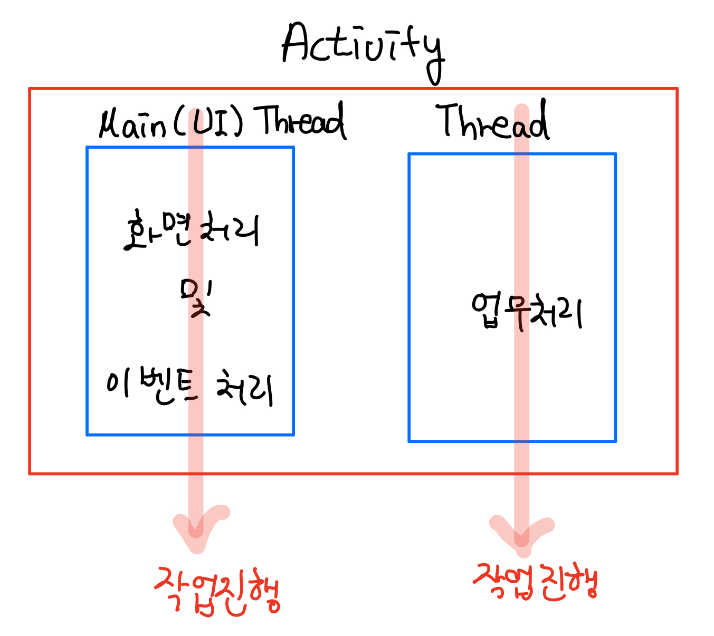
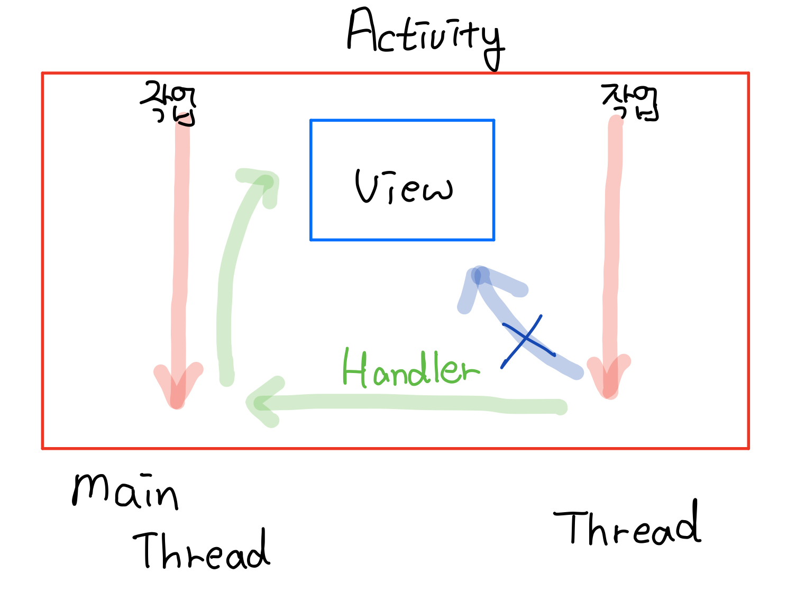
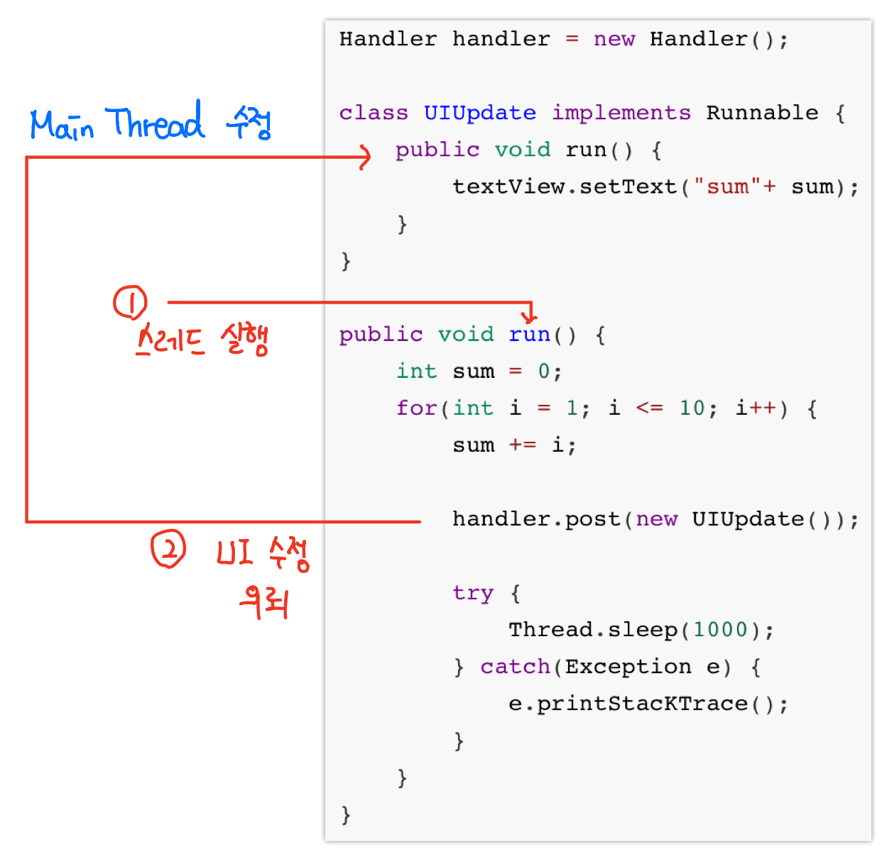
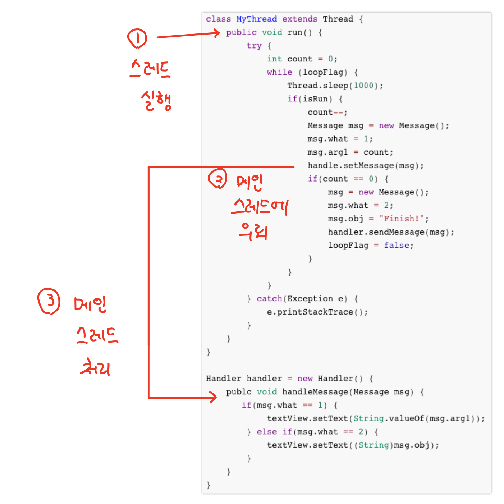

# 07. 스레드와 애니메이션

## 추가내용) ANR

ANR (Application Not Responding)이란 액티비티가 사용자 이벤트에 반응하지 못하는 상황을 말한다. 액티비티가 화면에 출력된 상황에서 사용자 이벤트에 5초 이내에 반응하지 못하면 시스템에서 액티비티를 강제로 종료된다. 이러한 상황은 액티비티 내에서 특정 업무 처리 로직을 수행하는데 시간이 오래 걸려 사용자의 이벤트를 처리하지 못하고 5초가 지나게 되는 상황이다.


- ANR 해결 방법

액티비티에서 5초 이상 업무처리를 하느라 사용자의 이벤트를 처리하지 못하는 것은 액티비티의 수행흐름이 하나이기 때문이다. 인텐트가 발생하여 액티비티가 생성되고 onCreate() 함수부터 호출되는 수행흐름이 하나이므로 시간이 오래 걸리는 작업이 있을 때 사용자 이벤트 처리가 되지 않는 것이다.

ANR 문제를 해결하는 방법은 액티비티의 수행 흐름을 하나 더 만들어 주면 된다. 즉, 스레드를 활용하여 수행흐름을 여러 개로 만듬으로써 하나의 수행흐름이 오래 걸리는 작엄을 수행하고 다른 수행 흐름이 사용자의 이벤트를 처리하면 되는 것이다. 안드로이드에서는 엑티비티 안의 화면 이벤트 처리를 수행하는 Main (UI) Thread 가 있으며, 기타 작업은 별도로 스레드를 생성하여 작업을 수행해야 한다.



## 07-1 스레드-핸들러 사용하기

### 스레드

안드로이드에서 스레드를 만들려면 자바의 Thread API를 그대로 활용한다. 스레드를 만드는 방법은 Thread 클래스를 상속받거나 Runnable 인터페이스를 구현하여 작성하는 2가지가 있다. 

- Thread 클래스 사용예

  Thread 클래스를 상속받아 클래스를 하나 만들어 run() 함수를 재정의 한다.

  ```java
  class MyThread extends Thread{
      public void run() {
          ... ...
      }
  }
  ```

  정의한 Thread 클래스를 생성해 시작하면 run() 함수가 실행되며 수행이 끝나면 스레드는 자동으로 종료된다.

  ```java
  MyThread thread = new MyThread();
  thread.start();
  ```

- Runnable 인터페이스 사용예

  Runnable 인터페이스를 구현하여 이 클래스가 스레드에 의해 처리될 내용을  작성한다.

  ```java
  class MyThread implements Runnable {
      public void run() {
          ... ...
      }
  }
  
  MyThread runnable = new MyThread();
  my_thread = new Thread(runnable);
  my_thread.start();
  ```


  스레드 생성자의 매개 변수로 Runnable 객체를 주면 스레드가 시작될 때 Runnable의 run() 함수를 실행한다. 아래 코드는 스레드를 사용해서 1에서 10까지 더한 예이다. Thread.sleep(1000) 코드는 스레드 동작을 1초 동안 멈추었다가 움직이는 코드이다.

  ```java
  public void run() {
      int sum = 0;
      for(int i = 1; i <= 10; i++) {
          sum += i;
          try {
              Thread.sleep(1000);
          } catch(Exception e) {
              e.printStacKTrace();
          }
      }
  }
  ```


### 핸들러

액티비티에서 스레드를 만들어 시간이 오래 걸리는 업무를 처리하면 ANR 문재를 해결할 수 있다. 하지만 스레드 코드 안에서 UI(TextView, EditText 등)에 결과물을 출력한다고 하면, 에러가 발생한다.

```java
public void run() {
    int sum = 0;
    for(int i = 1; i <= 10; i++) {
        sum += i;

        textView.setText(sum);
        
        try {
            Thread.sleep(1000);
        } catch(Exception e) {
            e.printStacKTrace();
        }
    }
}
```

에러가 발생하는 이유는 안드로이드의 구조적 이유가 있다. 여러 스레드 들이 하나의 TextView에 동시에 접근하게 되면, 동기화 문제가 발생하게 된다. 안드로이드 시스템에서는 이를 방지하기 위해서 UI의 수정은 Main Thread에서만 하도록 강제되어 있다. 뷰를 접근할 수 있는 스레드를 하나로 지정함으로써 동기화 문제를 원천적으로 해소한 것이다. 

그렇다면 스레드에서 작업한 내용을 뷰에 적용하려면 어떻게 해야 할 것인가? 이때 Handler를 사용하게 된다.  작업한 스레드는 Handler 클래스를 이용해 Main Thread에 뷰를 수정해주는 작업을 의뢰하는 형태로 작업내용을 뷰에 적용할 수 있다.

​                                                                                    

- 핸들러에 작업 의뢰

  핸들러에게 뷰에 대한 작업을 의뢰하는 방법은 post() 혹은 sendMessage() 함수를 이용하는 방법이 있다.

  - post() 함수 활용

    Handler 클래스의 객체를 생성하고 뷰와 관련된 작업을 담당하는 클래스를 Runnable을 구현하여 작성하자.

    ```java
    Handler handler = new Handler();
    
    class UIUpdate implements Runnable {
        public void run() {
            textView.setText("sum"+ sum);
        }
    }
    ```

    UIUpdate는 뷰 업데이트를 위해 Main Thread에서 호출되는 클래스이다. 작업 스레드에서 뷰와 관련된 작업이 필요하면 Handler의 post()함수를 호출해 메인 스레드에게 작업을 의뢰한다.

    ```java
    public void run() {
        int sum = 0;
        for(int i = 1; i <= 10; i++) {
            sum += i;
    
            handler.post(new UIUpdate());
            
            try {
                Thread.sleep(1000);
            } catch(Exception e) {
                e.printStacKTrace();
            }
        }
    }
    ```

    뷰에 접근해야 하면 handler.post() 함수를 활용해 메인 스레드에게 의뢰하고 메인스레드는 post() 함수에 매개변수로 지정한 Runnable 객체의  run() 함수를 자동 호출한다. post() 함수 이외에 postDelayed() 함수를 사용하면 의뢰 시 지연 시간을 설정할 수 있다

    

    1. 스레드가 실행되면서 run() 함수 실행 , 이곳에서 특정 업무 수행
    2. 스레드에서 발생한 데이터를 하면에 출력하기 위해 handler.post() 함수를 이용해 메인 스레드에게 의뢰
    3. 메인 스레드는 post() 함수의 매개변수로 주어진 객체의 run() 함수를 호출하여 뷰와 관련된 작업 수행

  - sendMessage() 함수 이용

    sendMessage() 함수 외에 기능 특징에 따른 함수들이 존재한다.

    | 함수                                              | 설명                                                         |
    | ------------------------------------------------- | ------------------------------------------------------------ |
    | sendMessage(Message msg)                          | 메인 스레드에 의뢰                                           |
    | sendMessageAtFrontOfQueue(Message msg)            | 뷰 작업에 대한 의뢰가 반복해서 발생한 경우 메인 스레드에서 차례로 처리한다. 이번 의뢰를 우선적으로 먼저 처리할 때 쓴다. |
    | sendMessageAtTime(Message msg, long uptimeMillis) | 의뢰를 지정한 시간에 수행해 달라는 요청을 할때 쓴다.         |
    | sendMessageDelayed(Message msg, long delayMillis) | 의뢰를 바로 처리하지 않고 지정 시간 후에 수행해 달라는 요청을 할 때 쓴다. |
    | sendEmptyMessage(int what)                        | 데이터 전달 없이 의뢰하는 경우                               |

    sendMessage() 함수로 요청할 때 Message 객체가 매개변수로 사용되는데 , Message객체는 뷰작업을 의뢰할 때 메인 스레드에 넘기는 데이터를 담는 객체이다. Message 객체의 what, obj, arg1, arg2 변수에 필요한 만큼 데이터를 담아 메인 스레드에 전달하게 된다.

    | 변수       | 설명                                                         |
    | ---------- | ------------------------------------------------------------ |
    | what       | int형 변수로 구분자 역할을 한다. 개발자가 임의의 숫자로 요청을 구분하기 위해 사용 |
    | obj        | 메인 스레드에 넘길 데이터                                    |
    | arg1, arg2 | 메인 스레드에 넘길 데이터 간단한 숫자 데이터는 arg1, arg2 변수에 담아 전달한다. |

    아래 코드에서 sendMessage()는 두 부분에서 호출하고 있는데 구분하기 위해 what 값에 1, 2로 지정하였다. 첫번째 sendMessage() 함수는 arg1에 숫자를 저장하였고 두번째는 문자열을 담아서 메인스레드에 의뢰하였다.

    ```java
    class MyThread extends Thread {
        public void run() {
            try {
                int count = 0;
                while (loopFlag) {
                    Thread.sleep(1000);
                    if(isRun) {
                        count--;
                        
                        Message msg = new Message();
                        msg.what = 1;
                        msg.arg1 = count;
                        handler.setMessage(msg);
                        
                        if(count == 0) {
                            msg = new Message();
                            msg.what = 2;
                            msg.obj = "Finish!";
                            handler.sendMessage(msg);
                            loopFlag = false;
                        }
                    }
                }
            } catch(Exception e) {
    			e.printStackTrace();
            }
        }
    }
    ```

    sendMessage() 함수로 요청을 처리하려면 Handler 클래스를 정의해야 한다.

    ```java
    Handler handler = new Handler() {
        publc void handleMessage(Message msg) {
           if(msg.what == 1) {
    			textView.setText(String.valueOf(msg.arg1));
    		} else if(msg.what == 2) {
                textView.setText((String)msg.obj);
    		}
        }
    }
    ```

    작업 스레드에서 sendMessage() 함수를 호출하는 순간 메인 스레드가 handleMessage() 함수를 호출하여 sendMessage() 함수 호출시 전달된 매개변수에 따라 요청에 따른 데이터를 처리해 주게 된다.

    
    ##### 주의 : 이미지 내에 오타가 발생했습니다.

    12줄 :  handle.sendMessage(msg);  >> handle**r**.sendMessage(msg);

    1. 작업 스레드에 의해 run() 함수 실행
    2. 작업 스레드에서 sendMessage() 함수로 의뢰 발생
    3. 메인 스레드에서 의뢰를 받아 Handler의 handleMessage() 함수를 호출하고 매개변수들이 handleMessage() 매개변수로 전달된다.


- 전체 코드

  - MainActivity.java

    ```java
    package rj.threadhandler;
    
    import android.os.Handler;
    import android.os.Message;
    import android.os.SystemClock;
    import android.support.v7.app.AppCompatActivity;
    import android.os.Bundle;
    import android.view.View;
    import android.widget.Button;
    import android.widget.ProgressBar;
    import android.widget.TextView;
    
    public class MainActivity extends AppCompatActivity {
        TextView tv_count;
        Button btn_start, btn_stop;
        ProgressBar pb_circle;
        int value = 0;
        Thread my_thread = null;
    
        @Override
        protected void onCreate(Bundle savedInstanceState) {
            super.onCreate(savedInstanceState);
            setContentView(R.layout.activity_main);
    
            tv_count = (TextView)findViewById(R.id.tv_count);
            btn_stop = (Button)findViewById(R.id.btn_stop);
            btn_start = (Button)findViewById(R.id.btn_start);
            pb_circle = (ProgressBar)findViewById(R.id.pb_circle);
    
            btn_stop.setOnClickListener(new BtnListener());
            btn_start.setOnClickListener(new BtnListener());
    
        }
    
        /**
         * Runnable 인터페이스 활용
         */
        //*
        Handler handler = new Handler();
    
        class UIUpdate implements Runnable {
            @Override
            public void run() {
                if(value < 1000) {
                    tv_count.setText(Integer.toString(value));
                    pb_circle.setVisibility(View.VISIBLE);
                } else {
                    tv_count.setText("1000번을 카운트 하였습니다.");
                    pb_circle.setVisibility(View.INVISIBLE);
                }
    
            }
        }
    
        class MyThread implements Runnable {
    
            @Override
            public void run() {
    
                try{
                    while(!Thread.currentThread().isInterrupted()) {
                        if(value < 1000) {
                            SystemClock.sleep(1000);
                            value++;
                            handler.post(new UIUpdate());
                        }
    
                    }
                } catch(Exception e) {
                    e.printStackTrace();
                }
    
    
            }
        }
    
        class BtnListener implements View.OnClickListener {
    
            @Override
            public void onClick(View view) {
                switch (view.getId()) {
                    case R.id.btn_start:
                        if(my_thread == null) {
                            MyThread runnable = new MyThread();
                            my_thread = new Thread(runnable);
                            my_thread.start();
                        }
                        break;
                    case R.id.btn_stop:
                        if(my_thread != null) {
                            my_thread.interrupt();
                            tv_count.setText("사용자에 의해 종료되었습니다.");
                            pb_circle.setVisibility(View.INVISIBLE);
                        }
                        break;
                }
            }
        }
        //*/
    
    }
    ```

  - activity_main.xml

    ```xml
    <?xml version="1.0" encoding="utf-8"?>
    <android.support.constraint.ConstraintLayout xmlns:android="http://schemas.android.com/apk/res/android"
        xmlns:app="http://schemas.android.com/apk/res-auto"
        xmlns:tools="http://schemas.android.com/tools"
        android:layout_width="match_parent"
        android:layout_height="match_parent"
        tools:context=".MainActivity">
    
        <TextView
            android:id="@+id/tv_count"
            android:layout_width="wrap_content"
            android:layout_height="18dp"
            android:text="Hello World!"
            app:layout_constraintBottom_toBottomOf="parent"
            app:layout_constraintLeft_toLeftOf="parent"
            app:layout_constraintRight_toRightOf="parent"
            app:layout_constraintTop_toTopOf="parent" />
    
        <Button
            android:id="@+id/btn_start"
            android:layout_width="wrap_content"
            android:layout_height="wrap_content"
            android:text="start"
            app:layout_constraintBottom_toBottomOf="parent"
            app:layout_constraintEnd_toEndOf="parent"
            app:layout_constraintStart_toStartOf="parent"
            app:layout_constraintTop_toTopOf="parent"
            app:layout_constraintVertical_bias="0.295" />
    
        <Button
            android:id="@+id/btn_stop"
            android:layout_width="wrap_content"
            android:layout_height="wrap_content"
            android:text="stop"
            app:layout_constraintBottom_toBottomOf="parent"
            app:layout_constraintEnd_toEndOf="parent"
            app:layout_constraintStart_toStartOf="parent"
            app:layout_constraintTop_toTopOf="parent"
            app:layout_constraintVertical_bias="0.101" />
    
        <ProgressBar
            android:id="@+id/pb_circle"
            style="?android:attr/progressBarStyle"
            android:layout_width="wrap_content"
            android:layout_height="wrap_content"
            android:visibility="invisible"
            app:layout_constraintBottom_toBottomOf="parent"
            app:layout_constraintEnd_toEndOf="parent"
            app:layout_constraintStart_toStartOf="parent"
            app:layout_constraintTop_toTopOf="parent"
            app:layout_constraintVertical_bias="0.686" />
    
    </android.support.constraint.ConstraintLayout>
    ```

    _


## 07-4 AsyncTask 사용하기

안드로이드에서는 스레드를 만들어서 직접 UI객체를 수정할 수 없다. 그 이유는 네트워크 요청 같이 대기시간이 길어지는 기능을 수행하면 화면에 보이는 UI가 멈춤 상태가 되어버리기 때문이다. 따라서 스레드와 헨들러를 연결하여 간접적으로 UI를 수정하지만, 다소 코드가 복잡해지게 된다. AsyncTask는 백그라운드 작업을 수행하면서 UI를 수정할 수 있는 코드를 정의할 수 있는 장점이 있다. 


- 주요 함수 (클래스)

| 함수                                | 설명                                                         |
| ----------------------------------- | ------------------------------------------------------------ |
| doInBackground(Params... params)    | 스레드에 의해 처리될 내용을 담기 위한 함수이다. 작업을 처리하기 전에 isCancelled() 함수의 리턴값을 체크하여 작업의 계속 진행 여부를 확인해야 한다. |
| onPreExecute()                      | AsyncTask의 작업을 시작하기 전에 호출하는 함수,  함수들중 가장 먼저 호출된다. |
| onPostExecute(Result result)        | AsyncTask의 모든 작업이 완료된 후 가장 마지막에 한번 호출되는 함수. doInBackground() 함수의 최종 값을 받기 위해 사용 |
| onProgressUpdate(Progress... value) | doInBackground() 함수에 의해 처리되는 중간중간 값을 받아 처리하기 위해 호출하는 함수. doInBackground() 함수에서 publishProgress() 함수로 넘긴 값이 전달된다. |
| onCancelled()                       | 작업을 취소할 때 호출되는 함수                               |

- AsyncTask 실행 및 중지 함수

  | 함수                   | 설명                                                         |
  | ---------------------- | ------------------------------------------------------------ |
  | AsyncTask.execute()    | Asynctack 객체를 실행한다.                                   |
  | AsyncTask.cancel(true) | doInBackground() 함수 실행중에 호출되면 하던 작업을 중단하고 onCencelled() 함수를 호출한다. |


AsyncTask 클래스는 추상클래스 이므로 함수 중 추상함수인 doInBackground()는 꼭 재정의 해서 작성해야 한다.

```java
myAsyncTask.execute();
myAsyncTask.cancel(true);

class MyAsyncTask extends AsyncTask<Void, Integer, String> {

	@Override
	protected String doInBackground(Void... params) {
        ...
        publishProgress(count);
		...
        return "finish";
	}

	@Override
	protected void onPreExecute() {
		super.onPreExecute();
	}

	@Override
	protected void onPostExecute(String s) {
		super.onPostExecute(s);
	}

	@Override
	protected void onProgressUpdate(Integer... values) {
		super.onProgressUpdate(values);
	}

	@Override
	protected void onCancelled() {
		super.onCancelled();
	}
}
```

AsyncTask 클래스를 상속받을 때 타입을 정확하게 지정하고 사용해야 한다. 위의 코드에서는 3가지 타입(Void, Integer, String)를 지정하여 사용하고 있다.

- 첫번째 타입 : 백그라운드 작업을 위한 doInBackground() 함수의 매개변수 타입과 같다. AsyncTask에 의해 백그라운드 작업을 의뢰할 때 넘기는 데이터의 타입이다. 없으면 Void로 지정
- 두번째 타입 : doInBackground() 함수 수행에 의해 발생한 데이터를 publishProgress()함수를 이용해 전달하는데 이때 전달할 데이터 타입이다. 데이터를 계속 전달받는 onProgressUpdate() 함수의 매개변수 타입과 동일하게 지정한다.
- 세번째 타입 : onPostExecute() 함수의 매개변수 타입과 동일하게 지정한다. doInBackground() 함수의 반환형이며 반환된 데이터가 onPostExecute() 함수의 매개변수로 전달된다.


- 예제 코드

  - MainActivity.java

  ```java
  package com.example.raejin.asynctask;
  
  import android.os.AsyncTask;
  import android.support.v7.app.AppCompatActivity;
  import android.os.Bundle;
  import android.view.View;
  import android.widget.Button;
  import android.widget.ProgressBar;
  import android.widget.TextView;
  import android.widget.Toast;
  
  public class MainActivity extends AppCompatActivity {
  
      int value;
      TextView textView_main;
      ProgressBar progressBar_main;
      Button button_main, button_end;
      MyTask myTask = null;
  
      @Override
      protected void onCreate(Bundle savedInstanceState) {
          super.onCreate(savedInstanceState);
          setContentView(R.layout.activity_main);
  
          textView_main = (TextView)findViewById(R.id.textView_main);
          progressBar_main = (ProgressBar)findViewById(R.id.progressBar_main);
          button_main = (Button)findViewById(R.id.button_main);
          button_end = (Button)findViewById(R.id.button_end);
  
  
  
          button_main.setOnClickListener(new View.OnClickListener() {
              @Override
              public void onClick(View view) {
                  if(myTask == null) {
                      myTask = new MyTask();
                      myTask.execute();
                  } else {
                      Toast.makeText(MainActivity.this, "이미 동작하고 있습니다.",
                              Toast.LENGTH_SHORT).show();
                  }
              }
          });
  
          button_end.setOnClickListener(new View.OnClickListener() {
              @Override
              public void onClick(View view) {
                  if(myTask != null){
                      myTask.cancel(true);
                      myTask = null;
                  }
              }
          });
  
      }
  
      class MyTask extends AsyncTask<Void, Void, Void> {
  
          protected Void doInBackground(Void... argu) {
              while(isCancelled() == false) {
                  value++;
                  if(value <= 1000) {
                      publishProgress();
                  }
                  else {
                      break;
                  }
                  try{
                      Thread.sleep(1000);
                  } catch(Exception e) {}
              }
              return null;
          }
          protected void onPreExecute() {
              value = 0;
              progressBar_main.setVisibility(View.INVISIBLE);
          }
          protected void onPostExecute(Void result) {
              textView_main.setText("1000번을 카운트하였습니다.");
              progressBar_main.setVisibility(View.INVISIBLE);
          }
  
          protected void onProgressUpdate(Void... argu) {
              progressBar_main.setVisibility(View.VISIBLE);
              textView_main.setText(Integer.toString(value));
          }
          protected void onCancelled() {
              textView_main.setText("사용자에 의해 종료되었습니다.");
              progressBar_main.setVisibility(View.INVISIBLE);
          }
      }
  
  
  }
  ```

  - activity_main.xml

  - ```xml
    <?xml version="1.0" encoding="utf-8"?>
    <android.support.constraint.ConstraintLayout xmlns:android="http://schemas.android.com/apk/res/android"
        xmlns:app="http://schemas.android.com/apk/res-auto"
        xmlns:tools="http://schemas.android.com/tools"
        android:layout_width="match_parent"
        android:layout_height="match_parent"
        tools:context="com.example.raejin.asynctask.MainActivity">
    
        <TextView
            android:id="@+id/textView_main"
            android:layout_width="wrap_content"
            android:layout_height="wrap_content"
            android:text="Hello World!"
            app:layout_constraintBottom_toBottomOf="parent"
            app:layout_constraintLeft_toLeftOf="parent"
            app:layout_constraintRight_toRightOf="parent"
            app:layout_constraintTop_toTopOf="parent" />
    
        <ProgressBar
            android:id="@+id/progressBar_main"
            style="?android:attr/progressBarStyle"
            android:layout_width="0dp"
            android:layout_height="wrap_content"
            android:layout_marginTop="8dp"
            android:visibility="invisible"
            app:layout_constraintBottom_toBottomOf="parent"
            app:layout_constraintEnd_toEndOf="parent"
            app:layout_constraintHorizontal_bias="0.0"
            app:layout_constraintStart_toStartOf="parent"
            app:layout_constraintTop_toTopOf="parent"
            app:layout_constraintVertical_bias="0.729" />
    
        <Button
            android:id="@+id/button_main"
            android:layout_width="wrap_content"
            android:layout_height="wrap_content"
            android:layout_marginBottom="53dp"
            android:layout_marginEnd="148dp"
            android:layout_marginStart="148dp"
            android:layout_marginTop="146dp"
            android:text="start"
            app:layout_constraintBottom_toTopOf="@+id/textView_main"
            app:layout_constraintEnd_toEndOf="parent"
            app:layout_constraintStart_toStartOf="parent"
            app:layout_constraintTop_toTopOf="parent" />
    
        <Button
            android:id="@+id/button_end"
            android:layout_width="wrap_content"
            android:layout_height="wrap_content"
            android:layout_marginBottom="44dp"
            android:layout_marginEnd="148dp"
            android:layout_marginStart="148dp"
            android:layout_marginTop="54dp"
            android:text="end"
            app:layout_constraintBottom_toTopOf="@+id/button_main"
            app:layout_constraintEnd_toEndOf="parent"
            app:layout_constraintStart_toStartOf="parent"
            app:layout_constraintTop_toTopOf="parent" />
    
    </android.support.constraint.ConstraintLayout>
    
    ```


## 추가내용) 프로그래스 바 (ProgressBar)

프로그래스바는 사용자에게 일의 진행 사항을 표시하기 위한 뷰이다. 프로그래스 바는 화면에서 파일을 내려받는 등 많은 시간이 걸리는 일을 처리할 때, 사용자에게 작업 중이라는 것을 표현하거나 일의 친척사항을 시각적으로 표시하기 때문에 직관적이다. 프로그래스바는 두가지 타입이 존재한다.

​	원형 타입 : 작업의 시작과 끝을 정확히 알 수 없는 경우 (예시 : 다운로드, 업로드)

​	막대 타입(Horizontal) : 작업의 시작과 끝을 정확히 알 수 있는 경우 (예시 : 동영상 혹은 음악파일의 진행바)


- 원형 타입

```xml
    <ProgressBar
        android:id="@+id/progressBar3"
        style="?android:attr/progressBarStyle"
        android:layout_width="wrap_content"
        android:layout_height="wrap_content" />
```

원형타입은 배치하면 무한적으로 동작하기 때문에 별도의 처리가 필요없다. 처음에는 Visible 속성을 gone 혹은 invisible로 설정하다가 작업이 시작되면 visible로 설정하여 프로그래스 바를 표현한다. 이후 작업이 완료되면 다시 Visible 속성을 gone 혹은 invisible로 지정하여 프로그래스바를 숨기는 형태로 활용하게 된다.


- 막대 타입

막대 타입의 경우 작업의 시작, 진행, 끝을 정확히 알 수 있는 경우에 활용되므로 다음 함수들로 값을 표시한다. 

| 함수                                   | 설명                                                         |
| -------------------------------------- | ------------------------------------------------------------ |
| setProgress(int progress)              | 프로그래스 바에 표시되는 값을 지정한다.                      |
| incrementProgressBy(int diff)          | 매개변수 값을 현재 값에서 더하거나 뺄때 사용한다.            |
| setSeconderyProgress(int progress)     | 프로그래스 바에 표시되는 두번째 값을 지정한다.               |
| incrementSecondaryProgressBy(int diff) | 두번째 표시되는 값을 매개변수 값 만큼 더하거나 뺄때 사용한다. |
| setMax(int max)                        | 프로그래스 바에 표시되는 최대값을 지정한다.                  |

막대 타입의 프로그래스 바는 작업의 진행사항을 즉시 반영하여 보여준다. 따라서 별도의 스레드-핸들러 혹은 AsyncTask 등을 활용하여 작업의 진행 정도에 따라 값을 변화시켜주어야 한다.


-  예제 코드

  - MainActivity.java

  ```java
  public class MainActivity extends AppCompatActivity {
  
      ProgressBar pb_circle, pb_bar;
      Button btn_start, btn_stop;
      MyAsyncTask myAsyncTask = null;
  
      @Override
      protected void onCreate(Bundle savedInstanceState) {
          super.onCreate(savedInstanceState);
          setContentView(R.layout.activity_main);
  
          pb_circle = (ProgressBar)findViewById(R.id.pb_circle);
          pb_bar = (ProgressBar)findViewById(R.id.pb_bar);
          btn_start = (Button)findViewById(R.id.btn_start);
          btn_stop = (Button)findViewById(R.id.btn_stop);
  
          pb_circle.setVisibility(View.VISIBLE);
  
          btn_stop.setOnClickListener(new myBtnListener());
          btn_start.setOnClickListener(new myBtnListener());
      }
  
      class myBtnListener implements View.OnClickListener {
          @Override
          public void onClick(View view) {
              switch(view.getId()) {
                  case R.id.btn_start:
                      if(myAsyncTask == null){
                          myAsyncTask = new MyAsyncTask();
                          myAsyncTask.execute();
                      }
                      break;
                  case R.id.btn_stop:
                      if(myAsyncTask != null){
                          myAsyncTask.cancel(true);
                          myAsyncTask = null;
                      }
                      break;
              }
          }
      }
  
      class MyAsyncTask extends AsyncTask<Void, Integer, Void> {
          int value;
  
          @Override
          protected Void doInBackground(Void... voids) {
              while(isCancelled() == false) {
                  value++;
  
                  SystemClock.sleep(10);
  
                  if(value <= 100) {
                      publishProgress(value);
                  } else {
                      break;
                  }
              }
              return null;
          }
  
          @Override
          protected void onPreExecute() {
              value = 0;
              pb_bar.setMax(100);
              pb_bar.setProgress(0);
          }
  
          @Override
          protected void onPostExecute(Void aVoid) {
              Toast.makeText(MainActivity.this, "100% 완료 되었습니다.",
                      Toast.LENGTH_SHORT).show();
          }
  
          @Override
          protected void onProgressUpdate(Integer... values) {
              pb_bar.setProgress(values[0]);
              Log.d("my_onProgressUpdate", values[0].toString());
          }
  
          @Override
          protected void onCancelled() {
              pb_bar.setProgress(0);
          }
      }
  }
  
  ```

  - activity_main.xml

  ```xml
  <?xml version="1.0" encoding="utf-8"?>
  <android.support.constraint.ConstraintLayout xmlns:android="http://schemas.android.com/apk/res/android"
      xmlns:app="http://schemas.android.com/apk/res-auto"
      xmlns:tools="http://schemas.android.com/tools"
      android:layout_width="match_parent"
      android:layout_height="match_parent"
      tools:context=".MainActivity">
  
      <ProgressBar
          android:id="@+id/pb_bar"
          style="?android:attr/progressBarStyleHorizontal"
          android:layout_width="0dp"
          android:layout_height="wrap_content"
          app:layout_constraintBottom_toBottomOf="parent"
          app:layout_constraintEnd_toEndOf="parent"
          app:layout_constraintHorizontal_bias="0.5"
          app:layout_constraintStart_toStartOf="parent"
          app:layout_constraintTop_toTopOf="parent" />
  
      <ProgressBar
          android:id="@+id/pb_circle"
          style="?android:attr/progressBarStyle"
          android:layout_width="wrap_content"
          android:layout_height="wrap_content"
          app:layout_constraintBottom_toBottomOf="parent"
          app:layout_constraintEnd_toEndOf="parent"
          app:layout_constraintStart_toStartOf="parent"
          app:layout_constraintTop_toTopOf="parent"
          app:layout_constraintVertical_bias="0.365" />
  
      <Button
          android:id="@+id/btn_start"
          android:layout_width="wrap_content"
          android:layout_height="wrap_content"
          android:text="START"
          app:layout_constraintBottom_toBottomOf="parent"
          app:layout_constraintEnd_toEndOf="parent"
          app:layout_constraintHorizontal_bias="0.165"
          app:layout_constraintStart_toStartOf="parent"
          app:layout_constraintTop_toTopOf="parent"
          app:layout_constraintVertical_bias="0.755" />
  
      <Button
          android:id="@+id/btn_stop"
          android:layout_width="wrap_content"
          android:layout_height="wrap_content"
          android:text="stop"
          app:layout_constraintBottom_toBottomOf="parent"
          app:layout_constraintEnd_toEndOf="parent"
          app:layout_constraintHorizontal_bias="0.827"
          app:layout_constraintStart_toStartOf="parent"
          app:layout_constraintTop_toTopOf="parent"
          app:layout_constraintVertical_bias="0.755" />
  
  
  </android.support.constraint.ConstraintLayout>
  ```


