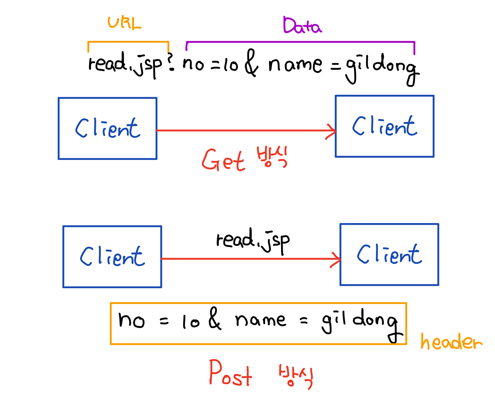

# 08. 네트워킹

## 08-3 웹으로 요청하기 (JAVA API를 이용한 HTTP 통신)

안드로이드 앱은 HTTP 네트워크 구조에서 주로 클라이언트로 활용되며 통신을 위해서는 서버 프로그램이 준비되어야 한다. 서버 프로그램은 웹 서버 애플리케이션을 작성하기 위한 JSP, ASP, PHP, Node.js 등으로 개발해야 한다. 

우선 앱에서 네트워크를 이용하려면 AndroidManifest.xml 파일에 다음처럼 퍼미션을 선언해야 한다.

```xml
<uses-permission android:name="android.permission.INTERNET"/>
```

Android.permission.INTERNET은 외부서버와 데이터를 주고 받을 때 필요한 퍼미션이므로 권한 선언 여부를 확인하자.

웹 서버와 연결하려면 URL 클래스와 HttpURLConnection클래스를 이용한다. URL 클래스는 서버의 URL 정보를 표현하며 실제 HTTP 연결을 요청하는 클래스는 HttpURLConnection이다.

```java
try {
	URL text = new URL(url);
	HttpURLConnection http = (HttpURLConnection)text.openConnection();
} catch(Exception e) {
	e.printStackTrace();
}
```

HttpURLConnection 클래스의 setter 함수들을 이용하여 다양하게 설정할 수 있다.

| 함수                 | 설명                                     |
| -------------------- | ---------------------------------------- |
| setConnectTimeout()  | 연결 타임아웃 시간 지정 (밀리초)         |
| setReadTimeout()     | 읽기 타임아웃 시간 지정 (밀리초)         |
| setDoInput()         | 데이터를 읽을 것인지 지정 (true / false) |
| setDoOutput()        | 데이터를 쓸것인지 지정 (true / false)    |
| setRequestProperty() | 요청 헤더를 지정                         |
| setRequestMethod()   | HTTP 요청 방식 지정 (get / post)         |

### 

- Get 과 Post 방식

서버에 전송하는 데이터는 일반 문자열, JSON, 질의 문자열 등의 형태로 전달된다. 일반적으로 질의 문자열이 많이 사용되는데, 질의 문자열이란 key와 value 값을 =로 연결하고 여러 데이터를 &로 연결하는 형태이다.

```http
http://www.naver.com/search?no=10&name=gildong
```

웹의 URL뒤에 ?을 구분자로 질의 문자열을 추가하여 전송하면 GET 방식이라 부르며 HTTP 요청 메시지에 포함하여 전송하여 전송하면 POST 방식이라 한다.



- 데이터의 전송 

  문자열 데이터를 서버에 전송할 경우 PrintWrite 클래스를 이용하며, 이미지 처럼 바이트 데이터를 서버에 전송하려면 OutputStream 클래스를 이용한다.

  - 문자열

  ```java
  PrintWriter writer = new PrintWriter(
                      (new OutputStreamWriter(http.getOutputStream(),"UTF-8")));
  writer.write("send data");
  writer.flush();
  ```

- 데이터의 수신

  서버로 부터 넘어오는 문자열 데이터를 수신하려면 바이트 스트림을 문자열 스트림으로 변경해주는 InputStreamReader와  데이터를 한줄씩 읽는 BufferedReader 객체를 활용하여 수신한다.

  - 문자열

  ```java
  bufferedReader = new BufferedReader(new InputStreamReader(
  									http.getInputStream(), "UTF-8"));
  StringBuffer stringBuffer = new StringBuffer();
  String line;
  
  while((line = bufferedReader.readLine()) != null) {
  	stringBuffer.append(line);
  }
  
  result = stringBuffer.toString();
  ```

  - 이미지

  ```java
  result = BitmapFactory.decodeStream(http.getInputStream());
  ```


- 전체 코드

  - AndroidManifest.xml

    ```xml
    ...
    <uses-permission android:name="android.permission.INTERNET"/>
    ...
    ```

  - MainActivity.java

    ```java
    public class MainActivity extends AppCompatActivity {
    
        TextView tv_data;
        ImageView iv_poster;
    
        @Override
        protected void onCreate(Bundle savedInstanceState) {
            super.onCreate(savedInstanceState);
            setContentView(R.layout.activity_main);
    
            tv_data = (TextView)findViewById(R.id.tv_data);
            iv_poster = (ImageView)findViewById(R.id.iv_poster);
    
            String url = "<서버 주소>";
            HashMap<String, String> map = new HashMap<String, String>();
            map.put("number","1");
    
            MyHttpTask myHttpTask = new MyHttpTask(url, map);
            myHttpTask.execute();
    
            String url_img = "<이미지 서버 주소>";
    
            MyImageHttpTask myImageHttpTask = new MyImageHttpTask(url_img, map);
            myImageHttpTask.execute();
    
        }
    
        class MyImageHttpTask extends AsyncTask<Void, Void, Bitmap> {
    
            String url_str;
            HashMap<String, String> map;
    
            public MyImageHttpTask(String url_str, HashMap<String, String> map) {
                super();
    
                this.url_str = url_str;
                this.map = map;
            }
    
            @Override
            protected Bitmap doInBackground(Void... voids) {
                Bitmap result = null;
                String post_query = "";
                PrintWriter printWriter = null;
    
                try {
                    URL text = new URL(url_str);
                    HttpURLConnection http = (HttpURLConnection)text.openConnection();
                    http.setRequestProperty("Content-type",
                            "application/x-www-form-urlencoded;charset=UTF-8");
                    http.setConnectTimeout(10000);
                    http.setReadTimeout(10000);
                    http.setRequestMethod("POST");
                    http.setDoInput(true);
                    http.setDoOutput(true);
    
                    if(map != null && map.size() > 0) {
    
                        Iterator<String> keys = map.keySet().iterator();
    
                        boolean first_query_part = true;
                        while(keys.hasNext()) {
    
                            if(!first_query_part) {
                                post_query += "&";
                            }
    
                            String key = keys.next();
                            post_query += (key + "=" + URLEncoder.encode(map.get(key), "UTF-8"));
    
                            first_query_part = false;
                        }
    
                        // sending to server
                        printWriter = new PrintWriter(new OutputStreamWriter(
                                http.getOutputStream(), "UTF-8"));
                        printWriter.write(post_query);
                        printWriter.flush();
    
                        // receive from server
                        result = BitmapFactory.decodeStream(http.getInputStream());
    
                    }
                } catch(Exception e) {
                    e.printStackTrace();
                    result = null;
                } finally {
                    try{
                        if(printWriter != null) printWriter.close();
                    } catch (Exception e) {
                        e.printStackTrace();
                    }
                    }
                return result;
            }
    
            @Override
            protected void onPostExecute(Bitmap s) {
                // do something
                iv_poster.setImageBitmap(s);
                this.cancel(true);
            }
    
            @Override
            protected void onCancelled() {
                super.onCancelled();
            }
        }
    
        class MyHttpTask extends AsyncTask<Void, Void, String> {
    
            String url_str;
            HashMap<String, String> map;
    
            public MyHttpTask(String url_str, HashMap<String, String> map) {
                super();
    
                this.url_str = url_str;
                this.map = map;
            }
    
            @Override
            protected String doInBackground(Void... voids) {
                String result = null;
                String post_query = "";
                PrintWriter printWriter = null;
                BufferedReader bufferedReader = null;
    
                try {
                    URL text = new URL(url_str);
                    HttpURLConnection http = (HttpURLConnection)text.openConnection();
                    http.setRequestProperty("Content-type",
                            "application/x-www-form-urlencoded;charset=UTF-8");
                    http.setConnectTimeout(10000);
                    http.setReadTimeout(10000);
                    http.setRequestMethod("POST");
                    http.setDoInput(true);
                    http.setDoOutput(true);
    
                    if(map != null && map.size() > 0) {
    
                        Iterator<String> keys = map.keySet().iterator();
    
                        boolean first_query_part = true;
                        while(keys.hasNext()) {
    
                            if(!first_query_part) {
                                post_query += "&";
                            }
    
                            String key = keys.next();
                            post_query += (key + "=" + URLEncoder.encode(map.get(key), "UTF-8"));
    
                            first_query_part = false;
                        }
    
                        // sending to server
                        printWriter = new PrintWriter(new OutputStreamWriter(
                                http.getOutputStream(), "UTF-8"));
                        printWriter.write(post_query);
                        printWriter.flush();
    
                        // receive from server
                        bufferedReader = new BufferedReader(new InputStreamReader(
                                http.getInputStream(), "UTF-8"));
                        StringBuffer stringBuffer = new StringBuffer();
                        String line;
    
                        while((line = bufferedReader.readLine()) != null) {
                            stringBuffer.append(line);
                        }
    
                        result = stringBuffer.toString();
                    }
                } catch(Exception e) {
                    e.printStackTrace();
                } finally {
                    try{
                        if(printWriter != null) printWriter.close();
                    } catch (Exception e) {
                        e.printStackTrace();
                    }
    
                    try {
                        if(bufferedReader != null) bufferedReader.close();
                    } catch (Exception e) {
                        e.printStackTrace();
                    }
                }
                return result;
            }
    
            @Override
            protected void onPostExecute(String s) {
                // do something
                tv_data.setText(s);
                this.cancel(true);
            }
    
            @Override
            protected void onCancelled() {
                super.onCancelled();
            }
        }
    }
    ```

  - activity_main.xml

    ```xml
    <?xml version="1.0" encoding="utf-8"?>
    <android.support.constraint.ConstraintLayout xmlns:android="http://schemas.android.com/apk/res/android"
        xmlns:app="http://schemas.android.com/apk/res-auto"
        xmlns:tools="http://schemas.android.com/tools"
        android:layout_width="match_parent"
        android:layout_height="match_parent"
        tools:context=".MainActivity">
    
        <TextView
            android:id="@+id/tv_data"
            android:layout_width="0dp"
            android:layout_height="0dp"
            android:layout_marginTop="8dp"
            android:text="Hello World!"
            android:textSize="14sp"
            app:layout_constraintBottom_toBottomOf="parent"
            app:layout_constraintHorizontal_bias="0.0"
            app:layout_constraintLeft_toLeftOf="parent"
            app:layout_constraintRight_toRightOf="parent"
            app:layout_constraintTop_toTopOf="@+id/guideline" />
    
        <ImageView
            android:id="@+id/iv_poster"
            android:layout_width="0dp"
            android:layout_height="0dp"
            android:layout_marginBottom="8dp"
            app:layout_constraintBottom_toTopOf="@+id/guideline"
            app:layout_constraintEnd_toEndOf="parent"
            app:layout_constraintHorizontal_bias="0.0"
            app:layout_constraintStart_toStartOf="parent"
            app:layout_constraintTop_toTopOf="parent"
            app:srcCompat="@color/colorAccent" />
    
        <android.support.constraint.Guideline
            android:id="@+id/guideline"
            android:layout_width="wrap_content"
            android:layout_height="wrap_content"
            android:orientation="horizontal"
            app:layout_constraintGuide_percent="0.6" />
    
    </android.support.constraint.ConstraintLayout>
    ```

- 결과 화면

  


## 추가 내용) JSON Parsing

서버와 통신할 때 문자열 데이터가 JSON 타입으로 전송될 경우에는 JSON 파싱을 이용하여 데이터를 얻어야 한다. 안드로이드에서는 JSON 파싱은 JSONObject 클래스와 JSONArray 클래스를 이용한다.

JSONObject는 JSON의 { }로 묶이는 부분의 내용을 표현하기 위한 클래스이며, JSONArray는 JSON의 [ ]로 묶이는 부분의 내용을 표현하기 위한 클래스이다. [ ]의 표현식은 그 안을 { }는 여러개 포함할 수 있는 형태이므로 { } 하나가 JSONObject객체로 표현되고 이 JSONObject 객체 여러개를 담기 위한 객체가 JSONArray이다.

```json
{
	"user": "gildong",
	"color": ["red", "green", "blue"]
}
```

  

```java
String json =
            "{" +
            "\"user\": \"gildong\"," +
            "\"color\": [\"red\", \"green\", \"blue\"]" +
            "}";

try {
	JSONObject root = new JSONObject(json);
} catch (Exception e) {
	e.printStackTrace();
}
```

JSONObject에 파싱할 JSON 문자열을 대입하면 최상위 JSONObject 객체가 만들어지며, 그 하위에 JSONObject 혹은 JSONArray 객체 여러개를 만들 수 있다. 루트 JSONObject 객체 안에 있는 키 user의 값은 getString(String key) 함수를 이용하여 데이터를 얻으면 되며, 키 color는 값이 [ ]로 묶여 있으므로 JSONArray 객체의 getString(int index)함수로 받아 얻어올 수 있다.

```java
try {
    JSONObject root = new JSONObject(json);

    String user_name = root.getString("user");
    JSONArray colors = root.getJSONArray("color");

    String first = colors.getString(0);
    String second = colors.getString(0);
    String third = colors.getString(0);
} catch (Exception e) {
	e.printStackTrace();
}
```


- Getter

  | 함수                                               | 설명                                                        |
  | -------------------------------------------------- | ----------------------------------------------------------- |
  | getString(String key), getString(int index)        | JSONObject, JSONArray 객체에서 String 형 값을 읽어온다.     |
  | getInt(String key), getInt(int index)              | JSONObject, JSONArray 객체에서 int 형 값을 읽어온다.        |
  | getBoolean(String key), getBoolean(int index),     | JSONObject, JSONArray 객체에서 Boolean 형 값을 읽어온다.    |
  | getDouble(String key), getDouble(int index)        | JSONObject, JSONArray 객체에서 Double 형 값을 읽어온다.     |
  | getLong(String key), getLong(int index)            | JSONObject, JSONArray 객체에서 Long 형 값을 읽어온다.       |
  | getJSONArray(String key), getJSONArray(int index)  | JSONObject, JSONArray 객체에서 JSONArray 형 값을 읽어온다.  |
  | getJSONObject(String key), getJSONArray(int index) | JSONObject, JSONArray 객체에서 JSONObject 형 값을 읽어온다. |


- 예시 코드

  - MainActivity.java

    ```java
    package rj.json;
    
    import android.support.v7.app.AppCompatActivity;
    import android.os.Bundle;
    import android.widget.TextView;
    
    import org.json.JSONArray;
    import org.json.JSONObject;
    import org.w3c.dom.Text;
    
    public class MainActivity extends AppCompatActivity {
    
        TextView tv_show;
    
        @Override
        protected void onCreate(Bundle savedInstanceState) {
            super.onCreate(savedInstanceState);
            setContentView(R.layout.activity_main);
            tv_show = (TextView)findViewById(R.id.tv_show);
    
            String json =
                    "{" +
                    "\"user\": \"gildong\"," +
                    "\"color\": [\"red\", \"green\", \"blue\"]" +
                    "}";
            try {
                JSONObject root = new JSONObject(json);
    
                String user_name = root.getString("user");
                JSONArray colors = root.getJSONArray("color");
    
                String first = colors.getString(0);
                String second = colors.getString(1);
                String third = colors.getString(2);
    
                for(int i = 0; i < colors.length(); i++) {
                    Log.d("show colors", colors.getString(i));
                }
    
                String result = "user : " + user_name + "\ncolor1 : " + first +
                        "\ncolor2 : " + second + "\ncolor3 : " + third;
    
                tv_show.setText(result);
            } catch (Exception e) {
                e.printStackTrace();
            }
    
        }
    }
    ```

  - activity_main.xml

    ```xml
    <?xml version="1.0" encoding="utf-8"?>
    <android.support.constraint.ConstraintLayout xmlns:android="http://schemas.android.com/apk/res/android"
        xmlns:app="http://schemas.android.com/apk/res-auto"
        xmlns:tools="http://schemas.android.com/tools"
        android:layout_width="match_parent"
        android:layout_height="match_parent"
        tools:context=".MainActivity">
    
        <TextView
            android:id="@+id/tv_show"
            android:layout_width="wrap_content"
            android:layout_height="wrap_content"
            android:text="Hello World!"
            android:textSize="18sp"
            app:layout_constraintBottom_toBottomOf="parent"
            app:layout_constraintLeft_toLeftOf="parent"
            app:layout_constraintRight_toRightOf="parent"
            app:layout_constraintTop_toTopOf="parent" />
    
    </android.support.constraint.ConstraintLayout>
    ```


### 퀴즈) 다음 JSON 파일 내용을 파싱하여 각 값을 앱 화면에 표시하시오.

```json
{
	"weather": [{
		"id": 721,
		"main": "Haze",
		"description": "haze",
		"icon": "50n"
	}],
	"main": {
		"temp": 10.14,
		"pressure": 1020,
		"humidity": 37,
		"temp_min": 6,
		"temp_max": 13
	},
	"id": 18392,
	"name": "Seoul",
	"cod": 200
}
```

