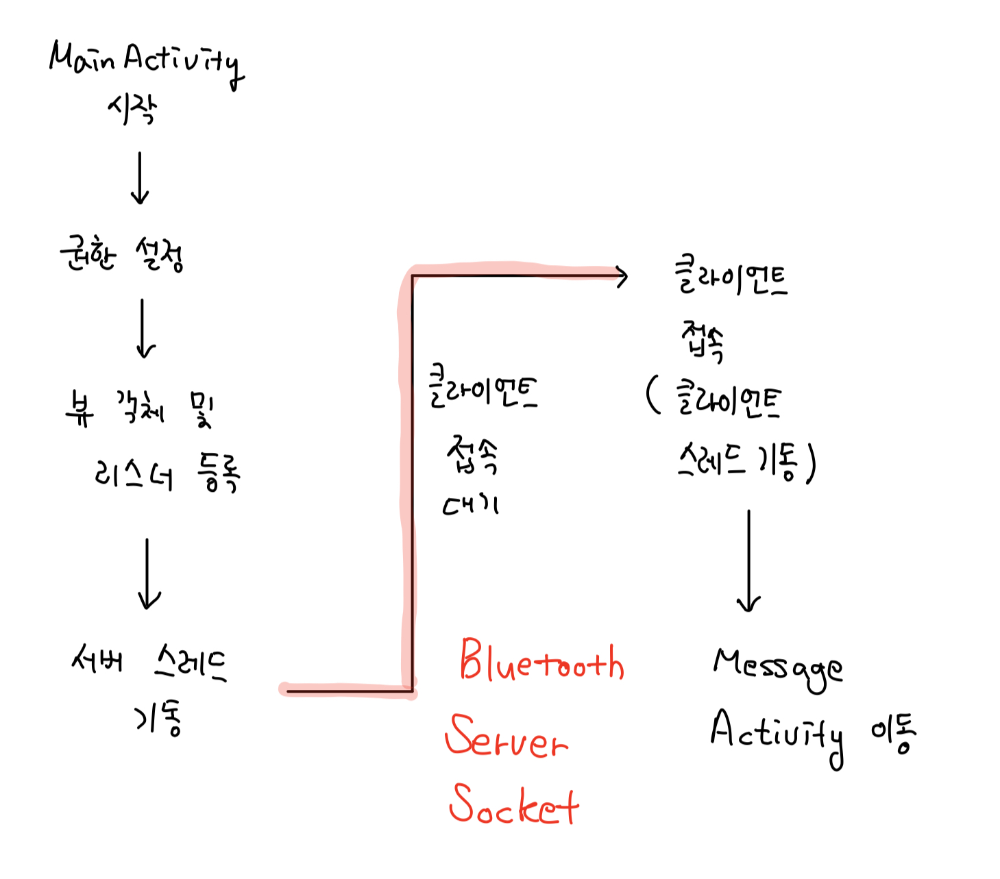
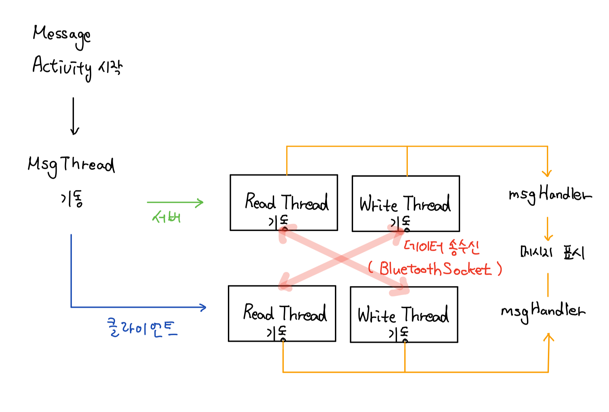

# 13. 근거리 통신

## 블루투스 설정

블루투스(Bluetooth)무선 근접 통신 방법으로 스마트폰과 스마트폰 혹은 스마트폰과 마우스 등 블루투스를 지원하는 다양한 기기와의 근접 통신에 이용된다. 

- 블루투스 지원 여부 확인

  블루투스와 관련된 작업은 퍼미션이 필요하다. BLUETOOTH 퍼미션은 페어링 된 기기와 데이터를 송수신하기 위해 필요하며, BLUETOOTH_ADMIN은 블루투스 환경설정을 위해 필요하다.

  ```xml
  <uses-permission android:name="android.permission.BLUETOOTH" />
  <uses-permission android:name="android.permission.BLUETOOTH_ADMIN" />
  ```

  일단 블루투스와 관련된 작업을 하기전에 앱이 동작하는 디바이스가 블루투스를 지원하는지를 체크해야 한다. 대부분의 스마트폰이 블루투스를 지원하지만 그렇지 않은 경우에 대비하여 블루투스 지원 여부를 판단하자.

  ```java
  BluetoothAdapter bluetoothAdapter = BluetoothAdapter.getDefaultAdapter();
  if(bluetoothAdapter == null) {
  	Toast.makeText(getApplicationContext(), "Bluetooth를 지원하지 않음",
  	Toast.LENGTH_SHORT).show();
  } else {
  	Toast.makeText(getApplicationContext(), "Bluetooth를 지원함",
  	Toast.LENGTH_SHORT).show();
  }
  ```


- 블루투스 활성 상태 변경

  블루투스를 지원한다면 블루투스를 활성화하거나 비활성화 해야 한다. 사용자가 직접 활성화 할수 있지만 앱에서도 이를 수행할 수 있다.

  ```java
  // 블루투스의 활성 / 비활성화
  if(!bluetoothAdapter.isEnabled()) {
      Intent intent = new Intent(BluetoothAdapter.ACTION_REQUEST_ENABLE);
      startActivityForResult(intent, 5);
  
  	//bluetoothAdapter.enable();
  } else {
  	//bluetoothAdapter.disable();
  }
  ```

  인텐트에  BluetoothAdapter.ACTION_REQUEST_ENABLE를 지정하여 발생시키면 사용자에게 블루투스 활성 여부를 묻는 대화상자를 띄울 수 있다. 대화상자의 선택결과에 따라 startActivityForResult() 함수에서 별도의 처리를 할 수 있다.

  ```java
  @Override
  protected void onActivityResult(int requestCode, int resultCode, Intent data) {
  	switch(requestCode) {
  		case 5:
  			// 블루투스 활성화
  			if(resultCode == RESULT_OK) {
  				Toast.makeText(getApplicationContext(), "Bluetooth가 활성화 되었습니다.",
  					Toast.LENGTH_SHORT).show();
  			} else if(resultCode == RESULT_CANCELED) {
  				Toast.makeText(getApplicationContext(), "Bluetooth가 활성화 되지 않았습니다.", Toast.LENGTH_SHORT).show();
  			}
  		}
  	}
  }
  ```

   이외에는 BluetoothAdapter의 enable() 혹은 disable() 함수를 호출하여 사용자 확인 없이 바로 블루투스 활성 / 비활성 할 수 있다. 


- 기기 검색 허용

  자신의 스마트폰을 다른 기기에서 검색되게 하려면 블루투스 검색을 허용해 주어야 한다. 검색이 허용된 스마트폰은 다른 기기에서 검색해서 인지할 수 있다.

  ```java
  // 기기 검색 허용
  Intent dIntent = new Intent(BluetoothAdapter.ACTION_REQUEST_DISCOVERABLE);
  dIntent.putExtra(BluetoothAdapter.EXTRA_DISCOVERABLE_DURATION, 100);
  startActivity(dIntent);
  ```

  BluetoothAdapter.ACTION_REQUEST_DISCOVERABLE 문자열을 인텐트에 담아 허용할 수 있으며, 추가 데이터로 검색허용 시간을 지정하여 보낼 수 있다. 이때 키 값은 BluetoothAdapter.EXTRA_DISCOVERABLE_DURATION로 지정하고 값은 0~3600초 까지 지정할 수 있다.


- 페어링 기기 검색

  특정 기기와 데이터 통신을 하려면 해당 기기와 페어링하여야 하는데 먼저 페어링된 기기 목록을 가져와야 한다.

  ```java
  // 페어링 기기 검색
  Set<BluetoothDevice> devices = bluetoothAdapter.getBondedDevices();
  if(devices.size() > 0) {
  	Iterator<BluetoothDevice> iter = devices.iterator();
  	while(iter.hasNext()) {
  		BluetoothDevice d = iter.next();
  		
  		Log.d("BLUETOOTH_TEST", "name : " +
          			d.getName() + " addr : " + d.getAddress());
  	}
  }
  ```

  기기 들의 정보는 BluetoothDevice 객체 안에 저장되어 있으며, getName(), getAddress() 함수로 기기의 이름과 MAC 주소를 얻을 수 있다.

  위의 코드에서 앱이 필요한 순간 페어링 된 기기의 목록을 얻을 수 있었다. 사용자의 환결설정에서 특정기기와 페어링 하는 순간 감지해야 할 때 앱을 실행하기 위한 브로드 캐스트 리시버를 작성한다.

  ```xml
  <receiver
  	android:name=".BluetoothReceier"
  	android:enabled="true"
  	android:exported="true">
  	<intent-filter>
  		<action android:name="android.bluetooth.device.action.FOUND"/>
  	</intent-filter>
  </receiver>
  ```

  브로드 캐스트 리시버를 android.bluetooth.device.action.FOUND 문자열로 등록하면 페어링 되는 순간 앱이 자동으로 실행된다.


## 블루투스 통신

- 서버로 등작

  데이터 통신에서 서버는 연결요청을 기다리고 있다가 외부 기기에서 연결 요청이 들어오는 순간 연결을 완성하며, 클라이언트는 서버에 연결 요청을 보낸다.

  먼저, 앱이 블루투스 서버로 동작하게 하는 방법은 BluetoothServerSocket클래스를 활용한다.

  ```java
  UUID MY_UUID = UUID.fromString("00001111-0000-1111-0000-0123456789AB");
  BluetoothServerSocket serverSocket =
        bluetoothAdapter.listenUsingRfcommWithServiceRecord("bluetooth_test", MY_UUID);
  ```

  BluetoothServerSocket 객체는 BluetoothAdapter 객체의 listenUsingRfcommWithServiceRecord() 함수를 활용하여 얻을 수 있다. 첫 매개변수는 서비스 이름으로 앱의 이름이나 임의로 지정할 수 있다. 두번째 매개변수는 UUID(Universally Unique Identifier) 값으로 서버와 클라이언트가 공유하여 연결한다.

  ```java
  BluetoothSocket socket = serverSocket.accept();
  ```

  BluetoothServerSocket의 accept() 함수가 실행되면 클라이언트에서 연결 요청이 오기까지 대기상태가 된다. 그러다 연결 요청이 들어오면 accept() 함수에서 클라이언트와 연결 객체인 BluetoothSocket을 반환하며, 이 객체를 이용하여 데이터를 송수신할 IO 객체를 만든다.


- 클라이언트로 동작

  앱이 블루투스 클라이언트로 동작하게 하는 방법을 알아보자. 서버에게 연결 요청을 하기 전에 BluetoothAdapter의 cancelDiscovery() 함수를 호출한다.

  ```java
  BluetoothAdapter adapter = BluetoothAdapter.getDefaultAdapter();
  adapter.cancelDiscovery();
  ```

  기기 검색 작업이 느려서 기기 간 연결이 안될 수 있는 점을 피하기 위해 검색을 잠시 멈추고 안전하게 연결하게 연결하자

  다음은 UUID로 식별되는 서버와 연결을 하기위해 페어링된 기기 정보인 BluetoothDevice의 createRfcommSocketToServerRecode() 함수를 호출하여 BluetoothSocket 객체를 얻고 BluetoothSocket의 connect() 함수를 호출하여 서버와 연결을 시도한다

  ```java
  BluetoothSocket clientSocket = device.createRfcommSocketToServerRecode(MY_UUID);
  clientSocket.connect();
  ```

  연결이 정상으로 이뤄지면 데이터를 송수신하게 된다. 


- 데이터의 송수신

  다음은 문자열을 서버에 전송하는 코드이다. BluetoothSocket의 getOutputStream() 함수를 호출하여 데이터 송신을 위한 객체를 얻어 데이터를 송신한다.

  ```java
  out = clientSocket.getOutputStream();
  out.write("Send Message".getBytes());
  out.flush();
  ```

  다음은 데이터 수신을 위한 코드로 BluetoothSocket의 getInputStream() 함수를 이용해 데이터 수신을 위한 객체를 얻고 read() 함수로 수신된 데이터를 읽는다.

  ```java
  byte[] buffer = new byte[1024];
  int bytes;
  in = new BufferedInputStream(clientSocket.getInputStream());
  bytes=in.read(buffer);
  ```


- 예제 코드

  - MainActivity.java

    ```java
    public class MainActivity extends AppCompatActivity {
    
        BluetoothAdapter bluetoothAdapter;
        Button btn_scan, btn_discover;
        ArrayList<BluetoothDevice> device_list;
        boolean bPerm;
        ListView lv_device;
        DeviceAdapter deviceAdapter;
        boolean bConn = false;
        boolean bSelect = false;
        AlertDialog selectDialog;
        BluetoothServerSocket serverSocket;
        static BluetoothSocket connSocket;
        BluetoothDevice targetDevice;
        final UUID MY_UUID = UUID.fromString("00001111-1010-1010-1010-12345678ABCD");
        ServerThread serverThread;
    
        @Override
        protected void onCreate(Bundle savedInstanceState) {
            super.onCreate(savedInstanceState);
            setContentView(R.layout.activity_main);
    
            // 권한 관련 설정
            setPermission(new String[] {
                    Manifest.permission.BLUETOOTH,
                    Manifest.permission.BLUETOOTH_ADMIN
            });
    
            // 뷰 객체 생성
            btn_discover = (Button) findViewById(R.id.btn_discover);
            btn_scan     = (Button) findViewById(R.id.btn_scan);
            lv_device    = (ListView) findViewById(R.id.lv_device);
    
            // 버튼 리스너 등록
            btn_discover.setOnClickListener(new BtnListener());
            btn_scan.setOnClickListener(new BtnListener());
    
            // 검색된 블루투스 기기 정보를 저장하기 위한 Arraylist
            device_list = new ArrayList<BluetoothDevice>();
    
            // 검색된 블루투스 기기 정보를 listview에 표시하기 위한 Adapter 생성 및 등록
            deviceAdapter = new DeviceAdapter(
                    MainActivity.this, R.layout.item_device,
                    device_list);
            lv_device.setAdapter(deviceAdapter);
    
            // 리스트뷰 리스너 등록
            lv_device.setOnItemClickListener(new ItemListener());
    
            // 블루투스 지원 여부 검사
            bluetoothAdapter = BluetoothAdapter.getDefaultAdapter();
            if(bluetoothAdapter != null) {
                // 블루투스 활성화
                bluetoothAdapter.enable();
    
                Toast.makeText(MainActivity.this, "서버 동작",Toast.LENGTH_SHORT).show();
    
                // 앱이 시작되면 서버 동작을 하기 위해 스레드를 구동한다.
                serverThread = new ServerThread();
                serverThread.start();
            } else {
                Toast.makeText(getApplicationContext(), "블루투스를 지원하지 않음",
                        Toast.LENGTH_SHORT).show();
                finish();
            }
        }
    
        class ItemListener implements AdapterView.OnItemClickListener {
            @Override
            public void onItemClick(AdapterView<?> adapterView, View view, int i, long l) {
                // 사용자가 선택한 블루투스 기기의 정보를 Arraylist에서 가져온다.
                targetDevice = device_list.get(i);
    
                Toast.makeText(MainActivity.this, "클라이언트 동작", Toast.LENGTH_SHORT).show();
    
                // 클라이언트 역할로 접속하기 위한 Thread를 기동한다.
                ClientThread clientThread = new ClientThread();
                clientThread.start();
    
                // 기존의 서버 역할로 접속하기 위한 스레드는 종료한다.
                serverThread.interrupt();
            }
        }
    
        // 서버 역할을 하기 위한 스레드
        class ServerThread extends Thread {
            @Override
            public void run() {
                while(!Thread.currentThread().isInterrupted()) {
                    // 연결 여부 및 블루투스 활성화 검사.
                    if(!bConn && bluetoothAdapter.isEnabled()) {
                        try {
                            // 서버 동작을 위한 BluetoothServerSocket 객체를 생성한다
                            serverSocket = bluetoothAdapter
                                    .listenUsingRfcommWithServiceRecord("MyBluetooth", MY_UUID);
    
                            // 연결을 기다리다가 클라이언트가 연결되면 BluetoothSocket를 생성한다.
                            // BluetoothSocket 객체로 통신을 할 수 있다.
                            connSocket = serverSocket.accept();
    
                            if(connSocket != null) {
                                // 메시지를 주고 받기 위해 MessageActivity로 이동하자.
                                Intent intent = new Intent(MainActivity.this,
                                        MessageActivity.class);
                                startActivity(intent);
                                bConn = true;
                            }
                        }
                        catch (Exception e) {
                            e.printStackTrace();
                        }
                    } else {
                        try {
                            Thread.sleep(500);
                        } catch (Exception e) {
                            e.printStackTrace();
                        }
                    }
                }
            }
        }
    
        // 클라이언트 역할을 하기 위한 스레드
        class ClientThread extends Thread {
    
            @Override
            public void run() {
                try {
                    // 기기 검색을 중지함
                    bluetoothAdapter.cancelDiscovery();
    
                    // 선택한 기기 정보를 활용하여 상호간에 통신을 위한 BluetoothSocket 객체를 얻는다.
                    connSocket = targetDevice.createInsecureRfcommSocketToServiceRecord(MY_UUID);
                    // 서버와 연결
                    connSocket.connect();
    
                    bConn = true;
    
                    // 데이터를 주고 받을 수 있는 MessageActivity로 이동
                    Intent intent = new Intent(MainActivity.this,
                            MessageActivity.class);
                    startActivity(intent);
                } catch (Exception e) {
                    e.printStackTrace();
                }
            }
        }
    
        class BtnListener implements View.OnClickListener {
            @Override
            public void onClick(View view) {
                switch(view.getId()) {
                    case R.id.btn_discover:     // 기기 검색 허용
                        Toast.makeText(getApplicationContext(), "다른 기기가 스마트폰을 검색하여 인지할 수 있음",
                                Toast.LENGTH_SHORT).show();
    
                        Intent intent = new Intent(BluetoothAdapter.ACTION_REQUEST_DISCOVERABLE);
                        intent.putExtra(BluetoothAdapter.EXTRA_DISCOVERABLE_DURATION, 1000);
                        startActivity(intent);
                        break;
                    case R.id.btn_scan:     // 페어링 기기 검색
                        Toast.makeText(getApplicationContext(), "페어링된 기기를 검색함",
                                Toast.LENGTH_SHORT).show();
    
                        Set<BluetoothDevice> devices = bluetoothAdapter.getBondedDevices();
                        device_list.clear();
    
                        if(devices.size() > 0) {
                            Iterator<BluetoothDevice> iter = devices.iterator();
                            while(iter.hasNext()) {
                                BluetoothDevice d = iter.next();
                                // 디바이스의 목록을 저장
                                device_list.add(d);
                                Log.d("BLUETEST", "name : " + d.getName() + " addr : " + d.getAddress());
                            }
    
                            deviceAdapter.notifyDataSetChanged();
                        } else {
                            Toast.makeText(getApplicationContext(),
                                    "검색된 기기가 없습니다.",
                                    Toast.LENGTH_SHORT).show();
                        }
                        break;
                }
            }
        }
    
        private void setPermission(String[] perm) {
            boolean bPerm = false;
    
            for (int i = 0; i < perm.length; i++) {
                if(ContextCompat.checkSelfPermission(getApplicationContext(), perm[i])
                        != PackageManager.PERMISSION_GRANTED) {
                    bPerm = false;
                }
            }
    
            if(!bPerm) {
                ActivityCompat.requestPermissions(
                        this, perm, 200);
            }
        }
    
        @Override
        public void onRequestPermissionsResult(int requestCode, @NonNull String[] permissions, @NonNull int[] grantResults) {
            boolean bPerm = true;
            super.onRequestPermissionsResult(requestCode, permissions, grantResults);
            if(requestCode == 200 && grantResults.length > 0) {
                for(int i = 0; i < grantResults.length; i++) {
                    if(grantResults[i] != PackageManager.PERMISSION_GRANTED) {
                        bPerm = false;
                    }
                }
            }
            this.bPerm = bPerm;
        }
    }
    ```

  - activity_main.xml

    ```xml
    <?xml version="1.0" encoding="utf-8"?>
    <android.support.constraint.ConstraintLayout xmlns:android="http://schemas.android.com/apk/res/android"
        xmlns:app="http://schemas.android.com/apk/res-auto"
        xmlns:tools="http://schemas.android.com/tools"
        android:layout_width="match_parent"
        android:layout_height="match_parent"
        tools:context=".MainActivity">
    
        <android.support.constraint.Guideline
            android:id="@+id/guideline"
            android:layout_width="wrap_content"
            android:layout_height="wrap_content"
            android:orientation="horizontal"
            app:layout_constraintGuide_end="45dp" />
    
        <android.support.constraint.Guideline
            android:id="@+id/guideline2"
            android:layout_width="wrap_content"
            android:layout_height="wrap_content"
            android:orientation="vertical"
            app:layout_constraintGuide_percent="0.5" />
    
        <Button
            android:id="@+id/btn_discover"
            android:layout_width="0dp"
            android:layout_height="wrap_content"
            android:layout_marginStart="8dp"
            android:layout_marginTop="8dp"
            android:layout_marginEnd="8dp"
            android:layout_marginBottom="8dp"
            android:text="기기 검색 허용"
            app:layout_constraintBottom_toBottomOf="parent"
            app:layout_constraintEnd_toStartOf="@+id/guideline2"
            app:layout_constraintStart_toStartOf="parent"
            app:layout_constraintTop_toTopOf="@+id/guideline" />
    
        <Button
            android:id="@+id/btn_scan"
            android:layout_width="0dp"
            android:layout_height="wrap_content"
            android:layout_marginStart="8dp"
            android:layout_marginTop="8dp"
            android:layout_marginEnd="8dp"
            android:layout_marginBottom="8dp"
            android:text="페어링 기기 검색"
            app:layout_constraintBottom_toBottomOf="parent"
            app:layout_constraintEnd_toEndOf="parent"
            app:layout_constraintStart_toStartOf="@+id/guideline2"
            app:layout_constraintTop_toTopOf="@+id/guideline" />
    
        <ListView
            android:id="@+id/lv_device"
            android:layout_width="0dp"
            android:layout_height="0dp"
            android:layout_marginStart="8dp"
            android:layout_marginTop="8dp"
            android:layout_marginEnd="8dp"
            android:layout_marginBottom="8dp"
            app:layout_constraintBottom_toTopOf="@+id/guideline"
            app:layout_constraintEnd_toEndOf="parent"
            app:layout_constraintStart_toStartOf="parent"
            app:layout_constraintTop_toTopOf="parent" />
    </android.support.constraint.ConstraintLayout>
    ```

  - FlowChart

  

  - MessageActivity.java

    ```java
    public class MessageActivity extends AppCompatActivity {
        TextView tv_log;
        Button btn_send;
        EditText et_msg;
        BluetoothSocket connSocket;
        boolean bRead = true;
        Handler writeHandler;
    
        MsgThread msgThread;
        WriteThread writeThread;
        ReadThread readThread;
        StringBuffer sb;
    
        final int SEND_MESSAGE = 100;
        final int RECEIVED_MESSAGE = 200;
    
        @Override
        protected void onCreate(Bundle savedInstanceState) {
            super.onCreate(savedInstanceState);
            setContentView(R.layout.activity_message);
    
            tv_log = (TextView)findViewById(R.id.tv_log);
            btn_send = (Button)findViewById(R.id.btn_send);
            et_msg = (EditText)findViewById(R.id.et_msg);
    
            // 서버와 클라이언트가 연결된 bluetoothSocket 객체
            connSocket = MainActivity.connSocket;
    
            // 전달할 메시지를을 저장할 Stringbuffer 객체
            sb = new StringBuffer();
    
            // 메시지 송수신을 위한 처리를 담당하는 스레드 생성 및 기동
            msgThread = new MsgThread();
            msgThread.start();
    
            btn_send.setOnClickListener(new View.OnClickListener() {
                @Override
                public void onClick(View view) {
                    String send_msg = et_msg.getText().toString() + "\n";
                    if(writeHandler != null) {
                        Message msg = new Message();
                        msg.obj = send_msg;
                        writeHandler.sendMessage(msg);
                    }
                }
            });
        }
    
        class MsgThread extends Thread {
    
            @Override
            public void run() {
                try {
                    // 기존에 readThread 가 있다면 중지한다.
                    if(readThread != null) {
                        readThread.interrupt();
                    }
                    // 데이터를 수신하기 위한 readThread 생성
                    readThread = new ReadThread(connSocket);
                    readThread.start();
    
                    // 기존에 writeThread 가 있다면 중지한다.
                    if(writeThread != null) {
                        // writeThread 내부에서 looper를 활용하고 있으므로
                        // looper를 종료해 주어야 한다.
                        writeHandler.getLooper().quit();
                    }
    
                    // 데이터를 송신하기 위한 writeThread 생성
                    writeThread = new WriteThread(connSocket);
                    writeThread.start();
    
                } catch (Exception e) {
                    e.printStackTrace();
                }
            }
        }
    
        // 송수신된 메시지를 화면에 TextView에 출력하기 위한 Handler
        Handler msgHandler = new Handler() {
            @Override
            public void handleMessage(Message msg) {
                super.handleMessage(msg);
                switch(msg.what) {
                    case SEND_MESSAGE:
                        sb.append("me > "+(String)msg.obj);
                        tv_log.setText(sb);
                        break;
                    case RECEIVED_MESSAGE:
                        sb.append("you > " + (String)msg.obj);
                        tv_log.setText(sb);
                        break;
                }
            }
        };
    
        // 작성한 메시지를 전송하는 스레드, 기기 외부와 통신해야 하므로 Thread로 구성한다.
        class WriteThread extends Thread {
            BluetoothSocket socket;
            OutputStream os = null;
    
            public WriteThread(BluetoothSocket socket) {
                // 통신을 위한 bluetoothSocket 객체를 받는다.
                this.socket = socket;
                try {
                    // bluetootsocket객체어서 OutputStream을 생성한다.
                    os = socket.getOutputStream();
                } catch (Exception e) {
                    e.printStackTrace();
                }
            }
    
            @Override
            public void run() {
                Looper.prepare();
                // 메시지를 받으면, 처리하는 핸들러
                writeHandler = new Handler() {
                    @Override
                    public void handleMessage(Message msg) {
                        try {
                            // 주어진 데이터를 OutputStream에 전달하여 상대측에 송신한다.
                            os.write(((String)msg.obj).getBytes());
                            os.flush();
    
                            // 전송한 데이터를 MessageActivity안의 TextView에 출력하기 위해 메시지를 전달한다.
                            Message msg_to_acti = new Message();
                            msg_to_acti.what = 200;
                            msg_to_acti.obj = msg.obj;
                            msgHandler.sendMessage(msg_to_acti);
                        } catch (Exception e) {
                            e.printStackTrace();
                            writeHandler.getLooper().quit();
                        }
                    }
                };
    
                Looper.loop();
            }
        }
    
        // 상대로 부터 메시지를 전달하기 위해 동작하는 스레드
        class ReadThread extends Thread {
            BluetoothSocket socket;
            BufferedInputStream bis = null;
    
            public ReadThread(BluetoothSocket socket) {
                this.socket = socket;
                try {
                    // bluetoothSocket에서 bufferedInputStream을 생성한다.
                    bis = new BufferedInputStream(
                            socket.getInputStream());
                } catch (Exception e) {
                    e.printStackTrace();
                }
            }
    
            @Override
            public void run() {
                while(!Thread.currentThread().isInterrupted() && bRead) {
                    try {
                        // 데이터를 임시로 저장할 버퍼를 만든다.
                        byte[] buf = new byte[1024];
                        // 버퍼에 데이터를 읽어온다.
                        int bytes = bis.read(buf);
                        // 읽어온 문자열 형태로 저장한다.
                        String read_str = new String(buf, 0, bytes);
    
                        // 읽어온 MessageActivity 안의 listview에 적용하기 위해 헨들러에 메시지를 전달한다
                        Message msg = new Message();
                        msg.what = 100;
                        msg.obj = read_str;
                        msgHandler.sendMessage(msg);
                    } catch (Exception e) {
                        e.printStackTrace();
                        bRead = false;
                    }
                }
            }
        }
    }
    
    ```

  - activity_message.xml

    ```xml
    <?xml version="1.0" encoding="utf-8"?>
    <android.support.constraint.ConstraintLayout xmlns:android="http://schemas.android.com/apk/res/android"
        xmlns:app="http://schemas.android.com/apk/res-auto"
        xmlns:tools="http://schemas.android.com/tools"
        android:layout_width="match_parent"
        android:layout_height="match_parent"
        tools:context=".MessageActivity">
    
        <EditText
            android:id="@+id/et_msg"
            android:layout_width="0dp"
            android:layout_height="0dp"
            android:layout_marginStart="8dp"
            android:layout_marginTop="8dp"
            android:layout_marginEnd="8dp"
            android:layout_marginBottom="8dp"
            android:ems="10"
            android:inputType="textPersonName"
            app:layout_constraintBottom_toBottomOf="parent"
            app:layout_constraintEnd_toStartOf="@+id/guideline5"
            app:layout_constraintStart_toStartOf="parent"
            app:layout_constraintTop_toTopOf="@+id/guideline3"
            app:layout_constraintVertical_bias="0.901" />
    
        <android.support.constraint.Guideline
            android:id="@+id/guideline3"
            android:layout_width="wrap_content"
            android:layout_height="wrap_content"
            android:orientation="horizontal"
            app:layout_constraintGuide_end="62dp" />
    
        <android.support.constraint.Guideline
            android:id="@+id/guideline5"
            android:layout_width="wrap_content"
            android:layout_height="wrap_content"
            android:orientation="vertical"
            app:layout_constraintGuide_end="69dp" />
    
        <Button
            android:id="@+id/btn_send"
            android:layout_width="0dp"
            android:layout_height="0dp"
            android:layout_marginTop="8dp"
            android:layout_marginEnd="8dp"
            android:layout_marginBottom="8dp"
            android:text="Send"
            app:layout_constraintBottom_toBottomOf="parent"
            app:layout_constraintEnd_toEndOf="parent"
            app:layout_constraintStart_toStartOf="@+id/guideline5"
            app:layout_constraintTop_toTopOf="@+id/guideline3"
            app:layout_constraintVertical_bias="1.0" />
    
        <ScrollView
            android:layout_width="0dp"
            android:layout_height="0dp"
            android:layout_marginStart="8dp"
            android:layout_marginTop="8dp"
            android:layout_marginEnd="8dp"
            android:layout_marginBottom="8dp"
            app:layout_constraintBottom_toTopOf="@+id/guideline3"
            app:layout_constraintEnd_toEndOf="parent"
            app:layout_constraintHorizontal_bias="0.5"
            app:layout_constraintStart_toStartOf="parent"
            app:layout_constraintTop_toTopOf="parent">
    
            <LinearLayout
                android:layout_width="match_parent"
                android:layout_height="wrap_content"
                android:orientation="vertical" >
    
                <TextView
                    android:id="@+id/tv_log"
                    android:layout_width="match_parent"
                    android:layout_height="match_parent"
                    android:textSize="18sp" />
            </LinearLayout>
        </ScrollView>
    
    </android.support.constraint.ConstraintLayout>
    ```

  - Flowchart

    

  - DeviceAdapter.java

    ```java
    public class DeviceAdapter extends BaseAdapter {
        ArrayList<BluetoothDevice> list;
        Context context;
        int layout_id;
        LayoutInflater layoutInflater;
    
        public DeviceAdapter(Context context, int layout_id,
                      ArrayList<BluetoothDevice> list) {
            this.context = context;
            this.layout_id = layout_id;
            this.list = list;
            this.layoutInflater = (LayoutInflater)context.getSystemService(
                    Context.LAYOUT_INFLATER_SERVICE);
        }
    
        @Override
        public int getCount() {
            return list.size();
        }
    
        @Override
        public Object getItem(int i) {
            return list.get(i);
        }
    
        @Override
        public long getItemId(int i) {
            return i;
        }
    
        @Override
        public View getView(int i, View view, ViewGroup viewGroup) {
            final int pos = i;
    
            if(view == null) {
                view = layoutInflater.inflate(layout_id, viewGroup, false);
            }
    
            TextView tv_name = (TextView) view.findViewById(R.id.tv_name);
            TextView tv_addr = (TextView) view.findViewById(R.id.tv_addr);
    
            tv_name.setText(list.get(pos).getName());
            tv_addr.setText(list.get(pos).getAddress());
    
            return view;
        }
    }
    ```

  - Item_device.xml

    ```xml
    <?xml version="1.0" encoding="utf-8"?>
    <android.support.constraint.ConstraintLayout xmlns:android="http://schemas.android.com/apk/res/android"
        xmlns:app="http://schemas.android.com/apk/res-auto"
        xmlns:tools="http://schemas.android.com/tools"
        android:layout_width="match_parent"
        android:layout_height="80dp">
    
        <android.support.constraint.Guideline
            android:id="@+id/guideline4"
            android:layout_width="wrap_content"
            android:layout_height="wrap_content"
            android:orientation="horizontal"
            app:layout_constraintGuide_percent="0.5" />
    
        <TextView
            android:id="@+id/tv_name"
            android:layout_width="wrap_content"
            android:layout_height="wrap_content"
            android:layout_marginStart="24dp"
            android:layout_marginTop="8dp"
            android:layout_marginBottom="8dp"
            android:text="TextView"
            android:textSize="24sp"
            android:textStyle="bold"
            app:layout_constraintBottom_toTopOf="@+id/guideline4"
            app:layout_constraintEnd_toEndOf="parent"
            app:layout_constraintHorizontal_bias="0.0"
            app:layout_constraintStart_toStartOf="parent"
            app:layout_constraintTop_toTopOf="parent" />
    
        <TextView
            android:id="@+id/tv_addr"
            android:layout_width="wrap_content"
            android:layout_height="wrap_content"
            android:layout_marginStart="8dp"
            android:text="TextView"
            android:textSize="18sp"
            app:layout_constraintBottom_toBottomOf="parent"
            app:layout_constraintEnd_toEndOf="parent"
            app:layout_constraintHorizontal_bias="0.073"
            app:layout_constraintStart_toStartOf="parent"
            app:layout_constraintTop_toBottomOf="@+id/guideline4"
            app:layout_constraintVertical_bias="0.466" />
    </android.support.constraint.ConstraintLayout>
    ```
